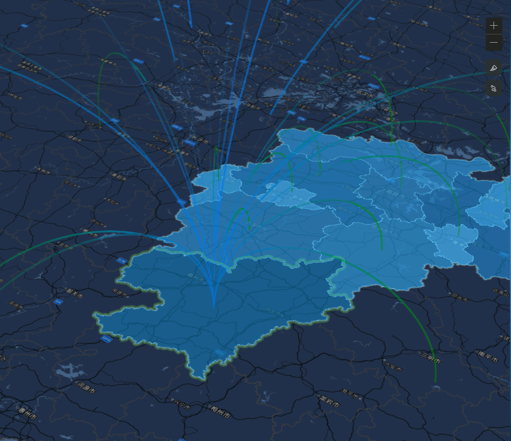

> 这个效果是某项目做人口迁徙的一个方案，用动态弧线展示人口迁入、迁出的效果。鼠标移动到弧线上会显示出详情。结合deck.gl和arcgis。 核心思路和结合threejs一样，还是扩展`externalRenderers`结合一些自定义shader来实现，做了省市二级联动。贴图就只贴地图上的效果了


## 效果



## 代码

DeckInstance.ts

```ts
i// eslint-disable-next-line @typescript-eslint/ban-ts-comment
// @ts-nocheck
import TileLayerDeckRenderer from './TileLayerDeckRenderer';
import * as externalRenderers from "@arcgis/core/views/3d/externalRenderers";

let renderer: any = null

export const getDeckInstance = (sceneView:__esri.SceneView) => {
    if (!renderer) {
        renderer = new TileLayerDeckRenderer(sceneView, {
            layers: []
        });
        externalRenderers.add(sceneView, renderer);
    }
    return renderer?.deck;
}


```

TileLayerDeckRenderer.ts

```ts
// eslint-disable-next-line @typescript-eslint/ban-ts-comment
// @ts-nocheck
import { DeckRenderer } from "@deck.gl/arcgis";
import { render } from "@deck.gl/arcgis/src/commons";

// ArcGIS fov is corner-to-corner
function arcgisFOVToDeckAltitude(fov: number, aspectRatio: number) {
    const D = Math.sqrt(1 + aspectRatio ** 2);
    const halfFOV = (fov / 2 / 180) * Math.PI;
    return D / 2 / Math.tan(halfFOV);
}

export default class TileLayerDeckRenderer extends DeckRenderer {
    callMe() {
        console.log('callme');
    }
    render(context) {
        const [width, height] = this.view.size;
        // 修复缩放绿屏问题。
        window.devicePixelRatio = 1;

        render.call(this, {
            gl: context.gl,
            width,
            height,
            viewState: {
                latitude: this.view.center.latitude,
                longitude: this.view.center.longitude,
                altitude: arcgisFOVToDeckAltitude(this.view.camera.fov, width / height),
                // TileLayer作为底图时会漂，issue 及修复的方法  https://github.com/visgl/deck.gl/issues/5271
                // zoom: this.view.basemapTerrain.tilingScheme.levelAtScale(this.view.scale),
                zoom: this.view.basemapTerrain.tilingScheme.levelAtScale(this.view.scale * 2),
                bearing: this.view.camera.heading,
                pitch: this.view.camera.tilt
            }
        });
    }
}

```
AnimatedArcLayer.ts
```ts
// eslint-disable-next-line @typescript-eslint/ban-ts-comment
// @ts-nocheck

import { ArcLayer } from "@deck.gl/layers";


const vsDeclaration = `
attribute float instanceFrequency;
varying float vArcLength;
varying float vFrequency;

//  新添加的
varying float vStartColor;

attribute vec3 aPosition;
attribute vec2 aUv;
varying vec2 vUv;

`
const vsMain = `
vArcLength = distance(source, target);
vFrequency = instanceFrequency;

vUv = aUv;
// gl_Position = vec4(aPosition, 1.0);
`


const fsColorFilter = `
float tripDuration = vArcLength / animationSpeed;
float flightInterval = 1.0 / vFrequency;
float r = mod(geometry.uv.x, flightInterval);

// Head of the trip (alpha = 1.0)
float rMax = mod(fract(timestamp / tripDuration), flightInterval);
// Tail of the trip (alpha = 0.0)
float rMin = rMax - tailLength / vArcLength;
// Two consecutive trips can overlap
float alpha = (r > rMax ? 0.0 : smoothstep(rMin, rMax, r)) + smoothstep(rMin + flightInterval, rMax + flightInterval, r);
if (alpha == 0.0) {
  discard;
}
color.a *= alpha;
// color.r = 0.1;
// color.g = 0.1;
// color.b = 0.1;
`

const fsDeclaration = `
uniform float tailLength;
uniform float timestamp;
uniform float animationSpeed;

varying float vArcLength;
varying float vFrequency;


varying vec2 vUv;
uniform sampler2D uColorTexture;
uniform vec2 uTexSize;
uniform vec2 uDirection;
uniform float uExposure;
uniform bool uUseLinear;
uniform float uRadius;

float gaussianPdf(in float x, in float sigma) {
    return 0.39894 * exp( -0.5 * x * x/( sigma * sigma))/sigma;
}

`
const fsMain = `


// vec2 invSize = 1.0 / uTexSize;
// float fSigma = float(100.0);
// float weightSum = gaussianPdf(0.0, fSigma);
// vec4 diffuseSum = texture2D( uColorTexture, vUv).rgba * weightSum;
// float radius = uRadius;

// for( int i = 1; i < 1; i ++ ) {
//   float x = float(i);
//   if(x > radius){
//     break;
//   }
//   float w = gaussianPdf(x, fSigma);
//   float t = x;
//   vec2 uvOffset = uDirection * invSize * t;
//   vec4 sample1 = texture2D( uColorTexture, vUv + uvOffset).rgba;
//   vec4 sample2 = texture2D( uColorTexture, vUv - uvOffset).rgba;
//   diffuseSum += (sample1 + sample2) * w;
//   weightSum += 2.0 * w;

// }
// vec4 result = vec4(1.0) - exp(-diffuseSum/weightSum * uExposure);
// gl_FragColor = result;

`

class AnimatedArcLayer extends ArcLayer {
    [x: string]: any;
    // constructor(props){
    //     super(props)
    // }

    getShaders() {
        const shaders = super.getShaders();
        shaders.inject = {
            'vs:#decl': vsDeclaration,
            'vs:#main-end': vsMain,
            'fs:#decl': fsDeclaration,
            'fs:DECKGL_FILTER_COLOR': fsColorFilter,
            'fs:#main-end': fsMain,
        };
        return shaders;
    }

    initializeState(params) {
        super.initializeState(params);

        this.getAttributeManager().addInstanced({
            instanceFrequency: {
                size: 1,
                accessor: 'getFrequency',
                defaultValue: 1
            },
        });
    }

    draw(opts) {
        this.state.model.setUniforms({
            tailLength: this.props.tailLength,
            animationSpeed: this.props.animationSpeed,
            timestamp: Date.now() % 86400000
        });
        super.draw(opts);

        // By default, the needsRedraw flag is cleared at each render. We want the layer to continue
        // refreshing.
        this.setNeedsRedraw();
    }
}
AnimatedArcLayer.defaultProps = {
    // Frequency of the running light
    getFrequency: { type: 'accessor', value: 1 },
    // Speed of the running light
    animationSpeed: { type: 'number', min: 0, value: 1 },
    // Size of the blob
    tailLength: { type: 'number', min: 0, value: 1 }
}

AnimatedArcLayer.layerName = 'AnimatedArcLayer';

export default AnimatedArcLayer;

```

## 用法

useAnimatedArcLayer.tsx
```ts
// eslint-disable-next-line @typescript-eslint/ban-ts-comment
// @ts-nocheck
import React, { useEffect } from 'react';
import ReactDOM from 'react-dom';
import { getDeckInstance } from '../utils/DeckInstance';
import type { PropsType } from './Component';
import { useMoveinSource } from './useMove';

import { TextLayer } from '@deck.gl/layers/typed';
import _ from 'lodash';
import { districtPointMap } from '../../../../../client/app/data/districtPoint';
import AnimatedArcLayer from '../utils/AnimatedArcLayer';

export const useAnimatedArcLayer = (props: PropsType) => {
    const { custom: { moveData, currentPac } } = props;
    // console.log('useAnimatedArcLayer - currentPac', currentPac)
    // console.log('useAnimatedArcLayer - moveData', moveData)
    const { superview } = props;


    const moveInSource = useMoveinSource(props);

    // console.log('useAnimatedArcLayer',moveInSource);

    const sceneView = superview.view.getRealView();
    // console.log('useAnimatedArcLayer - sceneView', sceneView)


    useEffect(() => {
        const tooltipEle = document.createElement('div')
        tooltipEle.setAttribute('id', 'map_tooltip');
        document.body.append(tooltipEle);
    }, [])

    useEffect(() => {

        if (sceneView && !_.isEmpty(moveInSource) && currentPac) {
            // console.log('useAnimatedArcLayer - sceneView', sceneView)
            const source = _.compact(moveInSource);
            const originData = districtPointMap[currentPac];
            const originPoint = originData?.geometry?.coordinates;
            const deckInstance = getDeckInstance(sceneView as __esri.SceneView);

            const arcLayer = new AnimatedArcLayer({
                // new ArcLayer({
                id: "arc-layer",
                data: source,
                pickable: true,
                getWidth: 3,
                animationSpeed: 0.003,
                tailLength: 10,
                autoHighlight: true,
                onHover: (line) => {
                    // console.log("hover", line);
                    const ele = document.getElementById('map_tooltip');
                    // console.log('useEffect - ele', ele)

                    if (line.index === -1) {
                        // ele.style.display='none'
                        ele.style.visibility = 'hidden'
                    } else {
                        // ele.style.left = `${line.devicePixel[0]}px`
                        // ele.style.top = `${line.devicePixel[1]}px`
                        ele.style.visibility = 'visible'
                        ele.style.left = `${line.pixel[0]}px`
                        ele.style.top = `${line.pixel[1]}px`

                        const { object: { attributes: { name, value } } } = line;
                        ReactDOM.render(
                            <div>
                                <span>{name}迁入： </span><span>{value}人</span>
                            </div>
                            , ele)
                    }

                    // ele?.style.top = line.devicePixel[1] + 'px';
                },
                getTooltip: ({ object }) => {
                    console.log("tooltip", object);
                    return object.attributes.name;
                },
                getSourcePosition: (d) => [d.geometry.x, d.geometry.y],
                // getTargetPosition: (d) => [115.95652812130174, 27.81],
                getTargetPosition: originPoint,
                //   getSourceColor: [30, 30, 0 ],
                //   getTargetColor: [30, 120, 239, 100 ],
                getTargetColor: (d) => [
                    Math.sqrt(d.attributes.value) >= 255
                        ? 255
                        : Math.sqrt(d.attributes.value) >= 255,
                    120,
                    239,
                    150,
                ],
                getSourceColor: (d) => [
                    Math.sqrt(d.attributes.value) >= 255
                        ? 255
                        : Math.sqrt(d.attributes.value) >= 255,
                    140,
                    0,
                    100,
                ],
            });

            //  TODO: 添加丢失的文字图层
            const textLayer =  new TextLayer({
                id: 'text-layer',
                data: _.compact(source),
                pickable: true,
                getPosition:(d) => [d.geometry.x, d.geometry.y],
                getText: d => {
                    console.log('d',d);
                    // return 'xxxx!!@#2133'
                    return d.attributes.value  + ' xx11'
                },
                getSize: 32,
                getAngle: 0,
                getTextAnchor: 'middle',
                getAlignmentBaseline: 'center'
              });

            // deckInstance.layers = [arcLayer,textLayer];
            deckInstance.layers = [arcLayer];
            // window.deckInstance=deckInstance;
        }

    }, [sceneView, moveInSource?.length])

}

```
