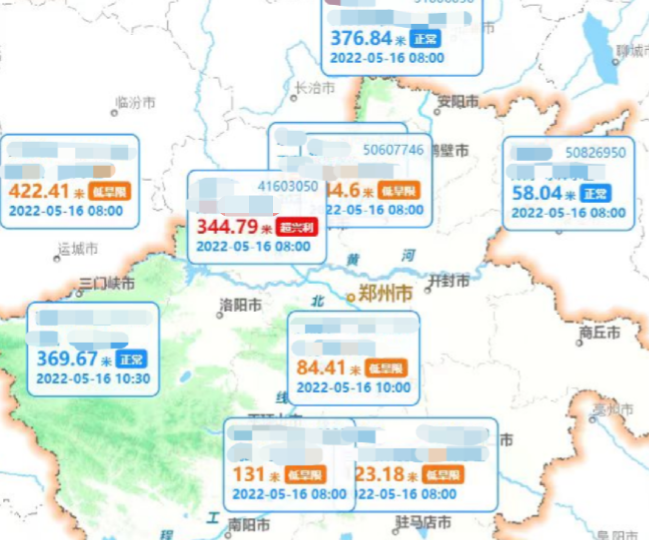
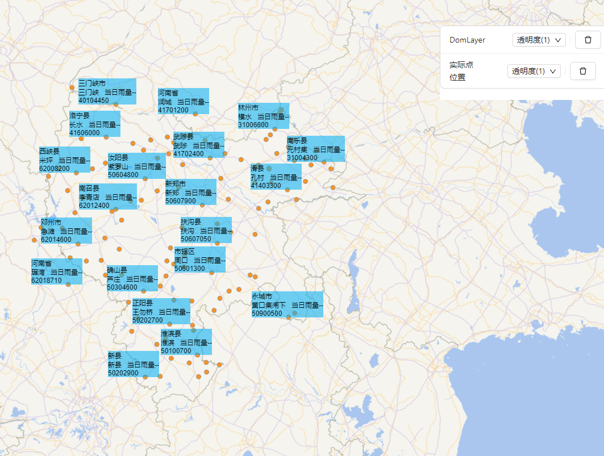
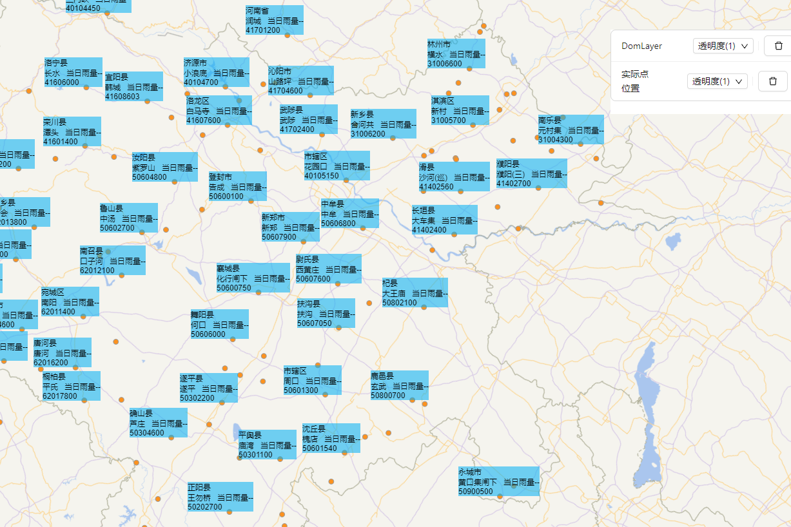
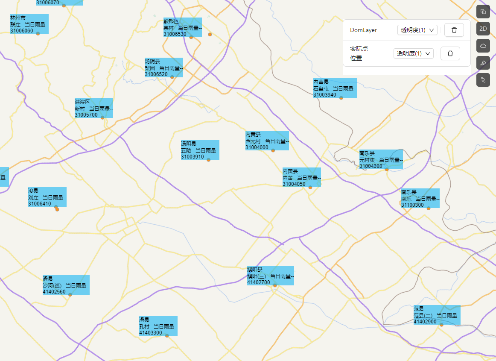
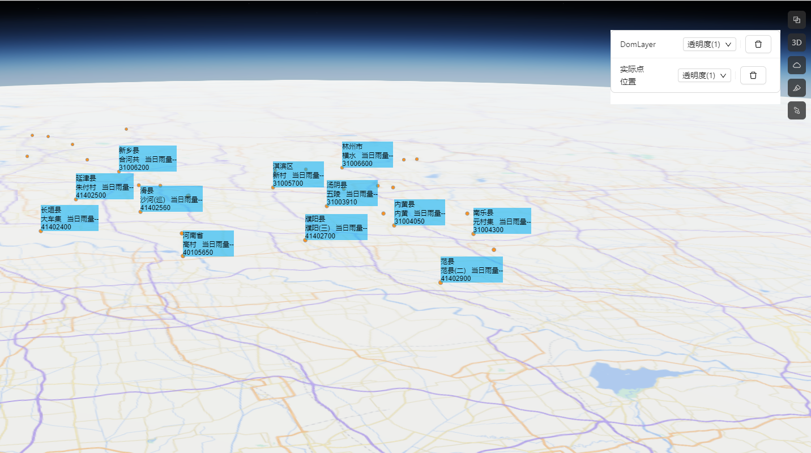
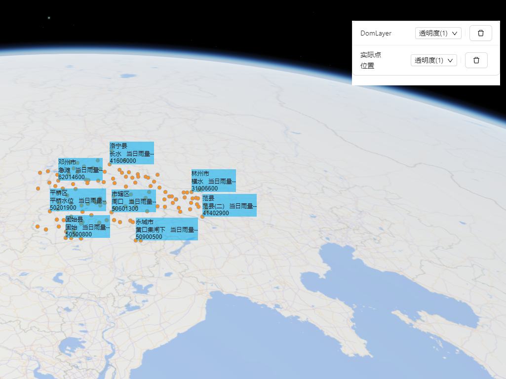
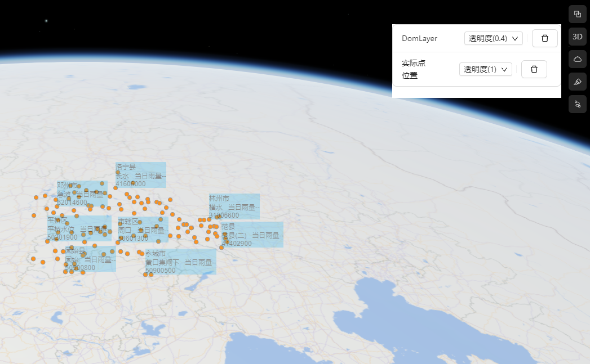

> ArcGIS 有很多类型的图层，但是没有“DomLayer”，即根据地图点位，所需要的内容通过 DOM 元素渲染，通过 css 和框架的渲染能力，可以做出来美观、灵活的显示内容，如饼图、表格、动画等。实现难点在于地图在大比例尺、小比例尺下，能统一显示效果，在小比例尺下不至于挤成一片。核心方法使用`rbush.js` 的 R 树空间索引索算法, 扩展图层的LayerView，参考网上前辈们分享的代码，做了改造。



## 效果

效果图上添加了 2 个图层，一个为 DomLayer，另外一个橙色的为所有点位图层，方便对比实际数据与渲染出 Domlayer 的数据。

- 在大比例尺下，屏幕范围点位多，domlayer 根据渲染出的效果不会有叠加遮挡
- 小比例尺下，在没有遮挡的情况下，数据显示基本完整
- 适配 2D、3D 图层 API，支持透明度调整
- 其他地图框架实现思路也类似

### 2D MapView





### 3D SceneView





## 代码

index.ts

```ts
import getDomLayer from "./DomLayer";
import { LayerType } from "../../../../../../../types/arcgisType";

const domLayerCreator = async (
  options: LayerType
): Promise<__esri.Layer | undefined> => {
  const DomLayer = await getDomLayer();
  return new DomLayer(options);
};

export default domLayerCreator;
```

DomLayer.ts

```ts
/* eslint-disable @typescript-eslint/no-explicit-any */
import requireArcgis from "../../../../../../../utils/requireArcgis";
import getDomLayerView2D from "./DomLayerView2D";
import getDomLayerView3D from "./DomLayerView3D";
import _ from "lodash";

// eslint-disable-next-line @typescript-eslint/explicit-module-boundary-types
const getDomLayer = async function () {
  const [Layer, Collection] = await requireArcgis([
    "esri/layers/Layer",
    "esri/core/Collection",
  ]);
  const DomLayerView2D = await getDomLayerView2D();
  const DomLayerView3D = await getDomLayerView3D();
  const clazz = Layer.createSubclass({
    constructor: function (options: any) {
      options = options || {};
      this.graphics = new Collection();
      this.popupEnabled = false;
      this.legendEnabled = false;
      this.direction = options.direction;
      this.type = "domLayer";

      this.graphics.on("after-add", (param: any) => {
        this.emit("after-add", param);
      });

      this.graphics.on("after-remove", (param: any) => {
        this.emit("after-remove", param);
      });
    },

    DIRECTION: ["bottom-right", "top-mid", "center"],
    direction: "center",

    declaredClass: "caihm.DivLayer",

    createLayerView: function (view: any) {
      this.view = view;
      if (view.type === "3d") {
        // window.layerView && window.layerView.destroy();
        console.log("has performance issue on 3d");
        this.layerView = new DomLayerView3D({
          view: view,
          layer: this,
        });
        // window.layerView = this.layerView;
      } else {
        // window.layerView && window.layerView.destroy();
        this.layerView = new DomLayerView2D({
          view: view,
          layer: this,
        });
        // window.layerView = this.layerView;
      }
      // eslint-disable-next-line @typescript-eslint/no-empty-function
      this.layerView.hitTest = () => {};
      return this.layerView;
    },

    destroyLayerView: function () {
      this.graphics = null;
      if (this.view.type === "3d") {
        this.layerView.destroy();
      }
    },

    load: function () {
      return this;
    },

    addMany(arr: any) {
      this.graphics.addMany(arr);
    },

    add: function (graphic: any) {
      this.graphics.add(graphic);
    },

    removeMany(arr: any) {
      this.graphics.removeMany(arr);
    },
    remove(graphic: any) {
      this.graphics.remove(graphic);
    },

    removeAll() {
      this.graphics.removeAll();
    },
  });

  return clazz;
};

export default getDomLayer;
```

DomLayerView2D.ts

```ts
/* eslint-disable @typescript-eslint/no-explicit-any */
import requireArcgis from "../../../../../../../utils/requireArcgis";
import { domStyle, domClass, domConstruct, lang } from "./domOpt";
import Rbush from "rbush";
import _ from "lodash";

// eslint-disable-next-line @typescript-eslint/explicit-module-boundary-types
const getDomLayerView2D = async function () {
  const [geometryEngine, LayerView, reactiveUtils] = await requireArcgis([
    "esri/geometry/geometryEngine",
    "esri/views/layers/LayerView",
    "esri/core/reactiveUtils",
  ]);

  const clazz = LayerView.createSubclass({
    transformOffset: {
      x: 0,
      y: 0,
    },
    isChanged: false,

    constructor(param: any) {
      param.layer.on("after-add", (param: any) => {
        this._add(param.item);
      });

      param.layer.on("after-remove", (param: any) => {
        this._remove(param.item);
      });

      this.direction = param.layer.direction;
    },

    _remove(ele: any) {
      if (ele.node) {
        domConstruct.destroy(ele.node);
      }
    },
    viewChange() {
      //   console.log('viewChange', evt);

      const currentScreenTarget = this.view.toScreen(this.dragStartCenter);

      if (this.screenTargetGeoemtry) {
        const dx = currentScreenTarget.x - this.screenTargetGeoemtry.x;
        const dy = currentScreenTarget.y - this.screenTargetGeoemtry.y;
        const translate = "translate3d(" + dx + "px," + dy + "px,0px)";
        domStyle.set(this._displayDiv, "transform", translate);
      }
    },
    moveStart() {
      // console.log('moveStart', evt);
      domClass.add(this._displayDiv, "moving");
      this.clearViewpointWatchers();

      this.calcTransform();
      this.dragStartCenter = this.view.center.clone();
      this.screenTargetGeoemtry = this.view.toScreen(this.dragStartCenter);

      this.screenTargetGeoemtry = {
        x: this.screenTargetGeoemtry.x - this.transformOffset.x,
        y: this.screenTargetGeoemtry.y - this.transformOffset.y,
      };
    },

    moveEnd() {
      // console.log('moveEnd', evt);
      this.clearViewpointWatchers();
      domClass.remove(this._displayDiv, "moving");
      window.requestAnimationFrame(() => {
        domStyle.set(this._displayDiv, "opacity", 1);
        this.refresh();
      });
    },

    clearViewpointWatchers: function () {
      while (this.viewpointWatchers?.length) {
        let viewpointWatcher = this.viewpointWatchers.pop();
        if (viewpointWatcher) {
          viewpointWatcher.remove();
          viewpointWatcher = null;
        }
      }
    },

    _add: function (ele: any) {
      const initStyle =
        "position:absolute;will-change:transform;top:0;left:0;pointer-events: auto;";
      if (ele.node && ele.node.parentNode === this._displayDiv) {
        //todo
      } else {
        if (lang.isString(ele.dom)) {
          ele.html = ele.dom;
          ele.dom = domConstruct.toDom(ele.html);
        } else if (lang.isString(ele.html)) {
          document.getElementById(ele.id)?.remove();
          ele.dom = domConstruct.toDom(ele.html);
        }

        ele.node = domConstruct.create(
          "div",
          {
            style: initStyle,
          },
          this._displayDiv
        );
        domConstruct.place(ele.dom, ele.node);
      }

      if (ele.option) {
        if (window?.echarts) {
          const myEchart = window.echarts.init(document.getElementById(ele.id));
          myEchart.setOption(ele.option);
        }
      }

      this.reposition(ele);
    },

    bindEvents: function () {
      this.events = [];
      this.viewpointWatchers = [];

      if (this.view.type === "2d") {
        this.events.push(
          reactiveUtils.watch(
            () => this.view.interacting,
            (_interacting: boolean) => {
              // console.log('=>(DomLayerView2D.ts:137) interacting', interacting);
              // if(_interacting) {
              //
              // }
              this.refresh();
            }
          )
        );
        this.events.push(
          reactiveUtils.watch(
            () => this.view.animation,
            (_animation: boolean) => {
              // console.log('=>(DomLayerView2D.ts:137) animation', animation);
              this.refresh();
            }
          )
        );
        this.events.push(
          reactiveUtils.watch(
            () => this.view.viewpoint,
            (_viewpoint: any) => {
              this.refresh();
            }
          )
        );
        this.events.push(
          // this.layer.watch('opacity', (opacity: any) => {
          //     domStyle.set(this._displayDiv, 'opacity', opacity);
          // }),
          reactiveUtils.watch(
            () => this.layer.opacity,
            (opacity: any) => {
              // console.log('=>(DomLayerView2D.ts:148) opacity', opacity);
              domStyle.set(this._displayDiv, "opacity", opacity);
            }
          )
        );
        this.events.push(
          // this.layer.watch('visible', (visible: any) => {
          //     domStyle.set(
          //         this._displayDiv,
          //         'display',
          //         visible ? 'block' : 'none',
          //     );
          //     this.refresh();
          //     this.refresh();
          // }),
          reactiveUtils.watch(
            () => this.layer.visible,
            (visible: any) => {
              // console.log('=>(DomLayerView2D.ts:148) visible', visible);
              domStyle.set(
                this._displayDiv,
                "display",
                visible ? "block" : "none"
              );
              this.refresh();
            }
          )
        );
      }
    },

    initialize(evt: any) {
      console.log("attach", evt);
      this.divLayerClass = "div-layer2d";
      const display = this.layer.visible ? "block" : "none";
      this._displayDiv = domConstruct.create("div", {
        innerHTML: "",
        style: `width:100%;height:100%;position: absolute;top: 0px;right: 0px;left: 0px;bottom: 0px;display:${display}`,
        className: this.divLayerClass,
      });

      console.log(this._displayDiv);

      const surface = this.view.root.children[1];
      domConstruct.place(this._displayDiv, surface);
      this.bindEvents();
      //   debugger;

      this.refresh();
    },

    calcTransform() {
      const matrix = new window.WebKitCSSMatrix(
        window.getComputedStyle(this._displayDiv).webkitTransform
      );
      const x = matrix.e;
      const y = matrix.f;

      this.transformOffset = {
        x: x,
        y: y,
      };
      return this.transformOffset;
    },

    getDomBox(dom: any) {
      const styles = window?.getComputedStyle(dom);

      // getComputedStyle() should return values already in pixels, so using parseInt()
      //   is not as much as a hack as it seems to be.

      return {
        minX: parseInt(styles.left),
        minY: parseInt(styles.top),
        maxX: parseInt(styles.left) + parseInt(styles.width),
        maxY: parseInt(styles.top) + parseInt(styles.height),
        height: parseFloat(styles.height),
        width: parseFloat(styles.width),
      };
    },

    refresh: function () {
      if (!this.layer.visible) return;
      if (window.__fantasy_map_isScene === true) {
        // this.destroy();
        return;
      }

      if (this.layer.minScale > 0) {
        domStyle.set(
          this._displayDiv,
          "opacity",
          this.view.scale >= this.layer.minScale ? 0 : 1
        );
      }
      if (this.layer.maxScale > 0) {
        domStyle.set(
          this._displayDiv,
          "opacity",
          this.view.scale < this.layer.maxScale ? 0 : 1
        );
      }

      // this.layer.box = []
      const rbush = new Rbush();
      this.calcTransform();
      console.time("refresh-domLayer");
      // domConstruct.empty(this._displayDiv);
      let inExtenCount = 0;
      this.layer.graphics.forEach((v: any) => {
        if (this.isInExtent(v)) {
          inExtenCount++;

          let notAdded = true;

          if (v.box) {
            const newPosition = this.getPosition(v);

            const eleHeight = v.box.height;
            const eleWidth = v.box.width;
            v.box = {
              minX: parseInt(newPosition.left),
              minY: parseInt(newPosition.top),
              maxX: parseInt(newPosition.left) + parseInt(eleWidth),
              maxY: parseInt(newPosition.top) + parseInt(eleHeight),
              height: parseFloat(eleHeight),
              width: parseFloat(eleWidth),
            };
          } else {
            notAdded = false;
            this._add(v);
            const box = this.getDomBox(v.node);

            v.box = box;
            domStyle.set(v.node, "height", v.box.height + "px");
            domStyle.set(v.node, "width", v.box.width + "px");

            if (this.direction == "center") {
              domStyle.set(v.node, "margin-left", "-" + v.box.width / 2 + "px");
              domStyle.set(v.node, "margin-top", "-" + v.box.height / 2 + "px");
            } else {
              domStyle.set(v.node, "margin-top", "-" + v.box.height + "px");
            }

            if (v.grade) domStyle.set(v.node, "z-index", 5 - Number(v.grade));
          }

          if (v.grade == "1" || v.grade == "2" || v.grade == "3") {
            rbush.insert(v.box);
            if (notAdded) {
              this._add(v);
              domStyle.set(v.node, "height", v.box.height + "px");
              domStyle.set(v.node, "width", v.box.width + "px");
              if (v.grade) domStyle.set(v.node, "z-index", 5 - Number(v.grade));
            }
            return;
          }
          const find = rbush.search(v.box);
          if (find.length) {
            domConstruct.destroy(v.node);
            v.node = null;
          } else {
            // if(box.minX&&box)
            rbush.insert(v.box);
            // this.layer.box.push(v.box);
            if (notAdded) {
              this._add(v);
              domStyle.set(v.node, "height", v.box.height + "px");
              domStyle.set(v.node, "width", v.box.width + "px");
              if (v.grade) domStyle.set(v.node, "z-index", 5 - Number(v.grade));
            }

            // domStyle.set(v.node, 'display', 'block');
          }
          // if (v.node) {

          // }
        } else {
          if (v.node) {
            // console.log('out range, destroy', v.node);
            domConstruct.destroy(v.node);
            v.node = null;
          }
        }
      });
      console.log("inExtenCount", inExtenCount);

      // setTimeout(() => {
      //     window.layer.closeAll('loading');
      // }, 1500);
      // $('.div-layer canvas').css('pointer-events', 'auto');
      console.timeEnd("refresh-domLayer");
    },

    isInExtent: function (ele: any) {
      return geometryEngine.contains(this.view.extent, ele.geometry);
    },
    // items: [],
    _repositionForDirection: function (ele: any) {
      if (ele.box) {
        const newSP = {};
        // var computedStyle = window.getComputedStyle(ele.node);
        const hieght = ele.box.height;
        const width = ele.box.width;

        switch (this.direction) {
          case "top-mid": {
            break;
          }
          case "center": {
            domStyle.set(ele.node, "margin-left", -width / 2 + "px");
            domStyle.set(ele.node, "margin-top", -hieght / 2 + "px");
            break;
          }
          default: {
            domStyle.set(ele.node, "margin-top", "-" + hieght + "px");
            break;
          }
        }

        return newSP;
      }
    },
    getPosition(ele: any) {
      if (this.view) {
        let sp = this.view.toScreen(ele.geometry);
        sp = {
          x: sp.x - this.transformOffset.x,
          y: sp.y - this.transformOffset.y,
          // x: sp.x,
          // y: sp.y,
        };

        return {
          left: sp.x,
          top: sp.y,
        };
      }
    },

    reposition: function (ele: any) {
      const position = this.getPosition(ele);
      if (position) {
        if (ele.node) {
          domStyle.set(ele.node, {
            top: position.top + "px",
            left: position.left - 65 + "px",
            // transform:
            //   'translate3d(' + position.left + 'px,' + position.top + 'px,0px )'
          });
          this._repositionForDirection(ele);
        } else {
          console.log("no node", ele);
        }
      }
    },
    detach() {
      this.destroy();
    },

    destroy() {
      domConstruct.destroy(this._displayDiv);

      Array.prototype.forEach.call(this.events, function (event) {
        if (event.remove) {
          event.remove();
        }
      });
      // arrayUtil.forEach(this.events, function(event) {
      //   if (event.remove) {
      //     event.remove();
      //   }
      // });
    },
  });

  return clazz;
};

export default getDomLayerView2D;
```

DomLayerView3D.ts

```ts
/* eslint-disable @typescript-eslint/no-explicit-any */
/* eslint-disable @typescript-eslint/no-empty-function */
/* eslint-disable no-debugger */
import requireArcgis from "../../../../../../../utils/requireArcgis";
import { domStyle, domClass, domConstruct, lang } from "./domOpt";
import Rbush from "rbush";

// eslint-disable-next-line @typescript-eslint/explicit-module-boundary-types
const getDomLayerView3D = async function () {
  const [geometryEngine, LayerView, reactiveUtils] = await requireArcgis([
    "esri/geometry/geometryEngine",
    "esri/views/layers/LayerView",
    "esri/core/reactiveUtils",
  ]);
  const clazz = LayerView.createSubclass({
    transformOffset: {
      x: 0,
      y: 0,
    },
    isChanged: false,
    constructor(param: any) {
      this.supportsDraping = true;
      this.overlayUpdating = false;
      // console.log(LayerView);
      this.elevationInfo = null;
      param.layer.on("after-add", (param: any) => {
        this._add(param.item);
      });

      param.layer.on("after-remove", (param: any) => {
        this._remove(param.item);
      });
    },

    render(evt: any) {
      console.log(evt);
    },

    _remove(ele: any) {
      if (ele.node) {
        domConstruct.destroy(ele.node);
      }
    },
    viewChange() {
      //   console.log('viewChange', evt);

      const currentScreenTarget = this.view.toScreen(this.dragStartCenter);

      if (this.screenTargetGeoemtry) {
        const dx = currentScreenTarget.x - this.screenTargetGeoemtry.x;
        const dy = currentScreenTarget.y - this.screenTargetGeoemtry.y;
        const translate = "translate(" + dx + "px," + dy + "px)";

        domStyle.set(this._displayDiv, "transform", translate);
      }
    },
    moveStart() {
      // console.log('moveStart', evt);
      domClass.add(this._displayDiv, "moving");
      this.clearViewpointWatchers();

      this.calcTransform();
      this.dragStartCenter = this.view.center.clone();
      this.screenTargetGeoemtry = this.view.toScreen(this.dragStartCenter);

      this.screenTargetGeoemtry = {
        x: this.screenTargetGeoemtry.x - this.transformOffset.x,
        y: this.screenTargetGeoemtry.y - this.transformOffset.y,
      };
    },

    moveEnd() {
      // console.log('moveEnd', evt);
      this.clearViewpointWatchers();
      domClass.remove(this._displayDiv, "moving");
      window.requestAnimationFrame(() => {
        this.refresh();
        domStyle.set(this._displayDiv, "opacity", "1");
      });
    },

    clearViewpointWatchers: function () {
      while (this.viewpointWatchers.length) {
        let viewpointWatcher = this.viewpointWatchers.pop();
        if (viewpointWatcher) {
          viewpointWatcher.remove();
          viewpointWatcher = null;
        }
      }
    },

    _add: function (ele: any) {
      if (ele.node && ele.node.parentNode === this._displayDiv) {
        //todo
      } else {
        if (lang.isString(ele.dom)) {
          ele.html = ele.dom;
          ele.dom = domConstruct.toDom(ele.html);
        } else if (lang.isString(ele.html)) {
          document.getElementById(ele.id)?.remove();
          ele.dom = domConstruct.toDom(ele.html);
        }

        ele.node = domConstruct.create(
          "div",
          {
            style: "position:absolute;pointer-events: auto;",
          },
          this._displayDiv
        );

        domConstruct.place(ele.dom, ele.node);
      }
      if (ele.option) {
        if (window?.echarts) {
          const myEchart = window.echarts.init(ele.dom);
          myEchart.setOption(ele.option);
        }
      }
      this.reposition(ele);
      this._repositionForDirection(ele);
    },

    bindEvents: function () {
      this.events = [];
      this.viewpointWatchers = [];

      // this.events.push(
      //     this.view.watch('stationary', (stationary: any) => {
      //         if (stationary) {
      //             domStyle.set(this._displayDiv, 'opacity', 1);
      //             this.refresh();
      //         } else {
      //             domStyle.set(this._displayDiv, 'opacity', 0);
      //         }
      //     }),
      // );

      // this.view.watch('camera', function (evt) {});
      this.events.push(
        reactiveUtils.watch(
          () => this.view.interacting,
          (_interacting: boolean) => {
            // console.log('=>(DomLayerView2D.ts:137) interacting', interacting);
            // if(_interacting) {
            //
            // }
            this.refresh();
          }
        )
      );
      this.events.push(
        reactiveUtils.watch(
          () => this.view.animation,
          (_animation: boolean) => {
            // console.log('=>(DomLayerView2D.ts:137) animation', animation);
            this.refresh();
          }
        )
      );
      this.events.push(
        reactiveUtils.watch(
          () => this.view.viewpoint,
          (_viewpoint: any) => {
            this.refresh();
          }
        )
      );
      this.events.push(
        // this.layer.watch('opacity', (opacity: any) => {
        //     domStyle.set(this._displayDiv, 'opacity', opacity);
        // }),
        reactiveUtils.watch(
          () => this.layer.opacity,
          (opacity: any) => {
            // console.log('=>(DomLayerView2D.ts:148) opacity', opacity);
            domStyle.set(this._displayDiv, "opacity", opacity);
          }
        )
      );
      this.events.push(
        // this.layer.watch('visible', (visible: any) => {
        //     domStyle.set(
        //         this._displayDiv,
        //         'display',
        //         visible ? 'block' : 'none',
        //     );
        //     this.refresh();
        //     this.refresh();
        // }),
        reactiveUtils.watch(
          () => this.layer.visible,
          (visible: any) => {
            // console.log('=>(DomLayerView2D.ts:148) visible', visible);
            domStyle.set(
              this._displayDiv,
              "display",
              visible ? "block" : "none"
            );
            this.refresh();
          }
        )
      );
    },

    updateClippingExtent() {
      debugger;
    },
    setup() {
      debugger;
    },

    initialize() {
      console.log("initialize", this);
      this.divLayerClass = "div-layer3d";
      this._displayDiv = domConstruct.create("div", {
        innerHTML: "",
        style:
          "width:100%;height:100%;position: absolute;top: 0px;right: 0px;left: 0px;bottom: 0px;",
        className: this.divLayerClass,
      });

      console.log(this._displayDiv);

      const surface = this.view.root.children[1];
      domConstruct.place(this._displayDiv, surface);
      this.bindEvents();
      //   debugger;

      this.refresh();

      // this.on('after-changes', function (evt) {
      //     debugger;
      // });
    },

    doRefresh(evt: any) {
      console.log("doRefresh", evt);
    },

    calcTransform() {
      const matrix = new window.WebKitCSSMatrix(
        window?.getComputedStyle(this._displayDiv).webkitTransform
      );
      const x = matrix.e;
      const y = matrix.f;

      this.transformOffset = {
        x: x,
        y: y,
      };
      return this.transformOffset;
    },

    getDomBox(dom: any) {
      const styles = window?.getComputedStyle(dom);

      // getComputedStyle() should return values already in pixels, so using parseInt()
      //   is not as much as a hack as it seems to be.

      return {
        minX: parseInt(styles.left),
        minY: parseInt(styles.top),
        maxX: parseInt(styles.left) + parseInt(styles.width),
        maxY: parseInt(styles.top) + parseInt(styles.height),
        height: parseFloat(styles.height),
        width: parseFloat(styles.width),
      };
    },

    refresh: function () {
      if (!this.layer.visible) return;
      if (window.__fantasy_map_isScene === false) {
        // this.destroy();
        return;
      }

      const rbush = new Rbush();
      this.calcTransform();
      console.time("refresh-domLayer");
      // domConstruct.empty(this._displayDiv);
      this.layer.graphics.forEach((v: any) => {
        if (this.isInExtent(v)) {
          let notAdded = true;

          if (v.box) {
            const newPosition = this.getPosition(v);

            const eleHeight = v.box.height;
            const eleWidth = v.box.width;
            v.box = {
              minX: parseInt(newPosition.left),
              minY: parseInt(newPosition.top),
              maxX: parseInt(newPosition.left) + parseInt(eleWidth),
              maxY: parseInt(newPosition.top) + parseInt(eleHeight),
              height: parseFloat(eleHeight),
              width: parseFloat(eleWidth),
            };
          } else {
            notAdded = false;
            this._add(v);
            const box = this.getDomBox(v.node);

            v.box = box;
            domStyle.set(v.node, "height", v.box.height + "px");
            domStyle.set(v.node, "width", v.box.width + "px");

            if (this.direction == "center") {
              domStyle.set(v.node, "margin-left", "-" + v.box.width / 2 + "px");
              domStyle.set(v.node, "margin-top", "-" + v.box.height / 2 + "px");
            } else {
              domStyle.set(v.node, "margin-top", "-" + v.box.height + "px");
            }

            if (v.grade) domStyle.set(v.node, "z-index", 5 - Number(v.grade));
          }

          if (v.grade == "1" || v.grade == "2" || v.grade == "3") {
            rbush.insert(v.box);
            if (notAdded) {
              this._add(v);
              domStyle.set(v.node, "height", v.box.height + "px");
              domStyle.set(v.node, "width", v.box.width + "px");
              if (v.grade) domStyle.set(v.node, "z-index", 5 - Number(v.grade));
            }
            return;
          }

          const find = rbush.search(v.box);
          if (find.length) {
            domConstruct.destroy(v.node);
            v.node = null;
          } else {
            // if(box.minX&&box)
            rbush.insert(v.box);
            if (notAdded) {
              this._add(v);
              domStyle.set(v.node, "height", v.box.height + "px");
              domStyle.set(v.node, "width", v.box.width + "px");
              if (v.grade) domStyle.set(v.node, "z-index", 5 - Number(v.grade));
            }

            // domStyle.set(v.node, 'display', 'block');
          }
          // if (v.node) {

          // }
        } else {
          if (v.node) {
            domConstruct.destroy(v.node);
            v.node = null;
          }
        }
      });
      // setTimeout(() => {
      //     window.layer.closeAll('loading');
      // }, 1500);
      // $('.div-layer canvas').css('pointer-events','auto');
      console.timeEnd("refresh-domLayer");
    },

    isInExtent: function (ele: any) {
      return geometryEngine.contains(this.view.extent, ele.geometry);
    },
    // items: [],
    _repositionForDirection: function (ele: any) {
      if (ele.box) {
        const newSP = {};
        // var computedStyle = window.getComputedStyle(ele.node);
        const hieght = ele.box.height;
        const width = ele.box.width;

        switch (this.direction) {
          case "top-mid": {
            break;
          }
          case "center": {
            domStyle.set(ele.node, "margin-left", -width / 2 + "px");
            domStyle.set(ele.node, "margin-top", -hieght / 2 + "px");
            break;
          }
          default: {
            domStyle.set(ele.node, "margin-top", "-" + hieght + "px");
            break;
          }
        }

        return newSP;
      }
    },
    getPosition(ele: any) {
      if (this.view) {
        let sp = this.view.toScreen(ele.geometry);
        sp = {
          x: sp.x - this.transformOffset.x,
          y: sp.y - this.transformOffset.y,
        };

        return {
          left: sp.x,
          top: sp.y,
        };
      }
    },

    reposition: function (ele: any) {
      const position = this.getPosition(ele);
      if (position) {
        domStyle.set(ele.node, {
          top: position.top + "px",
          left: position.left + "px",
        });
      }
    },

    destroy() {
      domConstruct.destroy(this._displayDiv);

      Array.prototype.forEach.call(this.events, function (event) {
        if (event.remove) {
          event.remove();
        }
      });
      // arrayUtil.forEach(this.events, function(event) {
      //   if (event.remove) {
      //     event.remove();
      //   }
      // });
    },
  });

  return clazz;
};

export default getDomLayerView3D;
```

domOpt.ts

```ts
/* eslint-disable @typescript-eslint/no-explicit-any */
export const domClass = {
  // eslint-disable-next-line @typescript-eslint/explicit-module-boundary-types
  add: function (dom: any, className: any) {
    dom?.classList.add(className);
  },
  // eslint-disable-next-line @typescript-eslint/explicit-module-boundary-types
  remove: function (dom: any, className: any) {
    dom?.classList.remove(className);
  },
};

export const domStyle = {
  // eslint-disable-next-line @typescript-eslint/explicit-module-boundary-types
  set: function (dom: any, styleKey: any, styleValue?: any) {
    if (typeof styleKey !== "string") {
      for (const key in styleKey) {
        if (key.includes("-")) {
          const arr = key.split("-");
          const newKey =
            arr[0] +
            arr[1].slice(0, 1).toUpperCase() +
            arr[1].slice(1).toLowerCase();
          dom.style[newKey] = styleKey[key];
        } else {
          dom.style[key] = styleKey[key];
        }
      }
    } else {
      if (styleKey.includes("-")) {
        const arr = styleKey.split("-");
        const newKey =
          arr[0] +
          arr[1].slice(0, 1).toUpperCase() +
          arr[1].slice(1).toLowerCase();
        dom.style[newKey] = styleValue;
      } else {
        dom.style[styleKey] = styleValue;
      }
    }
  },
};

export const domConstruct = {
  // eslint-disable-next-line @typescript-eslint/explicit-module-boundary-types
  create: function (tag: any, attrs: any, refNode?: any) {
    const el = window.document.createElement(tag);
    for (const attr in attrs) {
      if (attr == "style") {
        const arr = attrs["style"].split(";");
        // console.log(arr)
        for (const i in arr) {
          domStyle.set(el, arr[i].split(":")[0], arr[i].split(":")[1]);
        }
      } else {
        el[attr] = attrs[attr];
      }
    }
    if (refNode) {
      refNode.appendChild(el);
    }
    return el;
  },
  // eslint-disable-next-line @typescript-eslint/explicit-module-boundary-types
  place: function (subnode: any, node: any) {
    node.appendChild(subnode);
  },
  // eslint-disable-next-line @typescript-eslint/explicit-module-boundary-types
  destroy: function (node: any) {
    node?.parentNode?.removeChild(node);
  },
  // eslint-disable-next-line @typescript-eslint/explicit-module-boundary-types
  toDom: function (html: any) {
    const frag = document.createRange().createContextualFragment(html);
    return frag;
  },
  // create: _domConstruct.create,
  // place: _domConstruct.place,
  // destroy: _domConstruct.destroy,
  // toDom: _domConstruct.toDom
};

export const lang = {
  // eslint-disable-next-line @typescript-eslint/explicit-module-boundary-types
  isString: function (data: any) {
    return typeof data === "string";
  },
};
```

## 用法

`dom`是自定义的 dom 元素,`id`需要唯一。

```ts
const graphics = features.map((v, i: number) => {
  return {
    geometry: webMercatorUtils.geographicToWebMercator({
      type: "point",
      x: v.geometry.coordinate[0][0],
      y: v.geometry.coordinate[0][1],
      spatialReference: new SpatialReference(4326),
    }),
    dom: `<div id="domlayer-dom-${i}" class="infowindow ${
      setPptnColor(v.properties.ACCP)[0]
    } rain-condition-stpptnr" code="${v.properties.STCD}" sitename="${
      v.properties.STNM
    }"><div class="window">
              <span class="regin">${v.properties.ADNM}</span>
              <div class="title"><span>${
                v.properties.STNM
              }</span><span class="type">&nbsp;&nbsp;当日雨量</span><span class="num" rel="毫米">${
      v.properties.ACCP == null ? "--" : v.properties.ACCP
    }</span></div>
              <span class="no">${v.properties.STCD}</span>
              <div class="footer"></div></div></div>`,
    grade: setPptnColor(v.properties.ACCP)[1],
    id: `domlayer-dom-${i}`,
  };
});
layersFeature.add([
  {
    id: "111",
    title: "DomLayer",
    layerType: "DomLayer",
    layerName: "f",
    spatialReference: { wkid: 3857 },
    graphics,
  },
]);
layersFeature.add([
  {
    id: "pnts",
    title: "实际点位置",
    layerType: "GeoJSONLayer",
    url: "assets/domLayerExampleDataGeoJSON.json",
  },
]);
```
