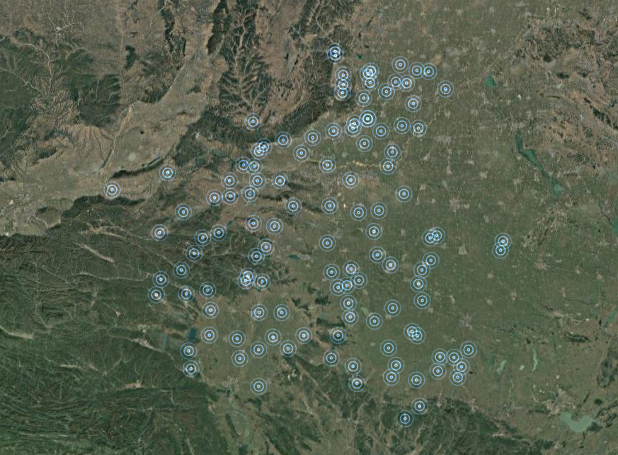

> 官方自带的一些图层类型想要做出一些花里胡哨的效果是比较难的，扩展 LayerView,使用自定义渲染可以实现一些想要的效果。



## 效果

录屏太麻烦，大概就是点位上有一圈一圈往外扩的动画效果


## 代码

index.ts

```ts
import { LayerType } from "../../../../../../../types/arcgisType";
import requireArcgis from "../../../../../../../utils/requireArcgis";
import { getLayerViewGL2D } from "./layerViewGL2D";

const flickerLayerCreator = async (
  options: LayerType
): Promise<__esri.Layer | undefined> => {
  const [Layer] = await requireArcgis(["esri/layers/Layer"]);
  const LayerViewGL2D = await getLayerViewGL2D();
  const FlickerLayer = Layer.createSubclass({
    createLayerView: function (view: __esri.MapView | __esri.SceneView) {
      if (view.type === "2d") {
        return new LayerViewGL2D({
          view: view,
          layer: this,
        });
      }
    },
  });
  return new FlickerLayer(options);
};

export default flickerLayerCreator;
```

layerViewGL2D.ts

```ts
// eslint-disable-next-line @typescript-eslint/ban-ts-comment
//@ts-nocheck
import requireArcgis from "../../../../../../../utils/requireArcgis";
import { mat3, vec2, vec3 } from "gl-matrix";

// eslint-disable-next-line @typescript-eslint/explicit-module-boundary-types
export const getLayerViewGL2D = async () => {
  const [BaseLayerViewGL2D, watchUtils, promiseUtils, webMercatorUtils] =
    await requireArcgis([
      "esri/views/2d/layers/BaseLayerViewGL2D",
      "esri/core/watchUtils",
      "esri/core/promiseUtils",
      "esri/geometry/support/webMercatorUtils",
    ]);
  const LayerViewGL2D = BaseLayerViewGL2D.createSubclass({
    aPosition: 0,
    aOffset: 1,

    constructor: function () {
      this.transform = mat3.create();
      this.translationToCenter = vec2.create();
      this.screenTranslation = vec2.create();

      this.display = mat3.fromValues(NaN, 0, 0, 0, NaN, 0, -1, 1, 1);
      this.screenScaling = vec3.fromValues(NaN, NaN, 1);
      this.needsUpdate = false;
      const requestUpdate = () => {
        this.needsUpdate = true;
        this.requestRender();
      };

      this.watcher = watchUtils.on(
        this,
        "layer.graphics",
        "change",
        requestUpdate,
        requestUpdate,
        requestUpdate
      );
    },

    attach: function () {
      const gl = this.context;

      // Define and compile shaders.
      const vertexSource = `
              precision highp float;
              uniform mat3 u_transform;
              uniform mat3 u_display;
              attribute vec2 a_position;
              attribute vec2 a_offset;
              varying vec2 v_offset;
              const float SIZE = 30.0;
              void main(void) {
                  gl_Position.xy = (u_display * (u_transform * vec3(a_position, 1.0) + vec3(a_offset * SIZE, 0.0))).xy;
                  gl_Position.zw = vec2(0.0, 1.0);
                  v_offset = a_offset;
              }`;

      const fragmentSource = `
              precision highp float;
              uniform float u_current_time;
              varying vec2 v_offset;
              const float PI = 3.14159;
              const float N_RINGS = 3.0;
              const vec3 COLOR = vec3(0.23, 0.43, 0.70);
              const float FREQ = 1.0;
              void main(void) {
                  float l = length(v_offset);
                  float intensity = clamp(cos(l * PI), 0.0, 1.0) * clamp(cos(2.0 * PI * (l * 2.0 * N_RINGS - FREQ * u_current_time)), 0.0, 1.0);
                  gl_FragColor = vec4(COLOR * intensity, intensity);
              }`;

      const vertexShader = gl.createShader(gl.VERTEX_SHADER);
      gl.shaderSource(vertexShader, vertexSource);
      gl.compileShader(vertexShader);
      const fragmentShader = gl.createShader(gl.FRAGMENT_SHADER);
      gl.shaderSource(fragmentShader, fragmentSource);
      gl.compileShader(fragmentShader);

      this.program = gl.createProgram();
      gl.attachShader(this.program, vertexShader);
      gl.attachShader(this.program, fragmentShader);

      gl.bindAttribLocation(this.program, this.aPosition, "a_position");
      gl.bindAttribLocation(this.program, this.aOffset, "a_offset");

      gl.linkProgram(this.program);

      gl.deleteShader(vertexShader);
      gl.deleteShader(fragmentShader);

      this.uTransform = gl.getUniformLocation(this.program, "u_transform");
      this.uDisplay = gl.getUniformLocation(this.program, "u_display");
      this.uCurrentTime = gl.getUniformLocation(this.program, "u_current_time");

      this.vertexBuffer = gl.createBuffer();
      this.indexBuffer = gl.createBuffer();

      this.indexBufferSize = 0;

      this.centerAtLastUpdate = vec2.fromValues(
        this.view.state.center[0],
        this.view.state.center[1]
      );
    },

    detach: function () {
      this.watcher.remove();

      const gl = this.context;

      gl.deleteBuffer(this.vertexBuffer);
      gl.deleteBuffer(this.indexBuffer);
      gl.deleteProgram(this.program);
    },

    render: function (renderParameters) {
      const gl = renderParameters.context;
      const state = renderParameters.state;

      this.updatePositions(renderParameters);

      // If there is nothing to render we return.
      if (this.indexBufferSize === 0) {
        return;
      }

      // Update view `transform` matrix; it converts from map units to pixels.
      mat3.identity(this.transform);
      this.screenTranslation[0] = (state.pixelRatio * state.size[0]) / 2;
      this.screenTranslation[1] = (state.pixelRatio * state.size[1]) / 2;
      mat3.translate(this.transform, this.transform, this.screenTranslation);
      mat3.rotate(
        this.transform,
        this.transform,
        (Math.PI * state.rotation) / 180
      );
      this.screenScaling[0] = state.pixelRatio / state.resolution;
      this.screenScaling[1] = -state.pixelRatio / state.resolution;
      mat3.scale(this.transform, this.transform, this.screenScaling);
      mat3.translate(this.transform, this.transform, this.translationToCenter);

      // Update view `display` matrix; it converts from pixels to normalized device coordinates.
      this.display[0] = 2 / (state.pixelRatio * state.size[0]);
      this.display[4] = -2 / (state.pixelRatio * state.size[1]);

      // Draw.
      gl.useProgram(this.program);
      gl.uniformMatrix3fv(this.uTransform, false, this.transform);
      gl.uniformMatrix3fv(this.uDisplay, false, this.display);
      gl.uniform1f(this.uCurrentTime, performance.now() / 1000.0);
      gl.bindBuffer(gl.ARRAY_BUFFER, this.vertexBuffer);
      gl.bindBuffer(gl.ELEMENT_ARRAY_BUFFER, this.indexBuffer);
      gl.enableVertexAttribArray(this.aPosition);
      gl.enableVertexAttribArray(this.aOffset);
      gl.vertexAttribPointer(this.aPosition, 2, gl.FLOAT, false, 16, 0);
      gl.vertexAttribPointer(this.aOffset, 2, gl.FLOAT, false, 16, 8);
      gl.enable(gl.BLEND);
      gl.blendFunc(gl.ONE, gl.ONE);
      gl.drawElements(gl.TRIANGLES, this.indexBufferSize, gl.UNSIGNED_SHORT, 0);

      // Request new render because markers are animated.
      this.requestRender();
    },

    hitTest: function (_mapPoint, screenPoint) {
      // Coordinates of the clicked screen point.
      const { x, y } = screenPoint;

      // The map view.
      const view = this.view;

      if (this.layer.graphics.length === 0) {
        // Nothing to do.
        return promiseUtils.resolve([]);
      }

      // Compute screen distance between each graphic and the test point.
      const distances = this.layer.graphics.map((graphic) => {
        const graphicPoint = view.toScreen(graphic.geometry);
        return Math.sqrt(
          (graphicPoint.x - x) * (graphicPoint.x - x) +
            (graphicPoint.y - y) * (graphicPoint.y - y)
        );
      });

      let minIndex = 0;

      distances.forEach((distance, i) => {
        if (distance < distances.getItemAt(minIndex)) {
          minIndex = i;
        }
      });

      const minDistance = distances.getItemAt(minIndex);

      if (minDistance > 35) {
        return promiseUtils.resolve([]);
      }

      const graphic = this.layer.graphics.getItemAt(minIndex);
      graphic.sourceLayer = this.layer;
      return promiseUtils.resolve([graphic]);
    },

    updatePositions: function (renderParameters) {
      const gl = renderParameters.context;
      const stationary = renderParameters.stationary;
      const state = renderParameters.state;

      if (!stationary) {
        vec2.sub(
          this.translationToCenter,
          this.centerAtLastUpdate,
          state.center
        );
        this.requestRender();
        return;
      }

      if (
        !this.needsUpdate &&
        this.translationToCenter[0] === 0 &&
        this.translationToCenter[1] === 0
      ) {
        return;
      }

      this.centerAtLastUpdate.set(state.center);
      this.translationToCenter[0] = 0;
      this.translationToCenter[1] = 0;
      this.needsUpdate = false;

      const graphics = this.layer.graphics;

      gl.bindBuffer(gl.ARRAY_BUFFER, this.vertexBuffer);
      const vertexData = new Float32Array(16 * graphics.length);

      let i = 0;
      graphics.forEach((graphic) => {
        const point = graphic.geometry;

        // The (x, y) position is relative to the encoded center.
        const x = point.x - this.centerAtLastUpdate[0];
        const y = point.y - this.centerAtLastUpdate[1];

        vertexData[i * 16 + 0] = x;
        vertexData[i * 16 + 1] = y;
        vertexData[i * 16 + 2] = -0.5;
        vertexData[i * 16 + 3] = -0.5;
        vertexData[i * 16 + 4] = x;
        vertexData[i * 16 + 5] = y;
        vertexData[i * 16 + 6] = 0.5;
        vertexData[i * 16 + 7] = -0.5;
        vertexData[i * 16 + 8] = x;
        vertexData[i * 16 + 9] = y;
        vertexData[i * 16 + 10] = -0.5;
        vertexData[i * 16 + 11] = 0.5;
        vertexData[i * 16 + 12] = x;
        vertexData[i * 16 + 13] = y;
        vertexData[i * 16 + 14] = 0.5;
        vertexData[i * 16 + 15] = 0.5;

        ++i;
      });

      gl.bufferData(gl.ARRAY_BUFFER, vertexData, gl.STATIC_DRAW);

      // Generates index data.
      gl.bindBuffer(gl.ELEMENT_ARRAY_BUFFER, this.indexBuffer);

      const indexData = new Uint16Array(6 * graphics.length);
      for (let i = 0; i < graphics.length; ++i) {
        indexData[i * 6 + 0] = i * 4 + 0;
        indexData[i * 6 + 1] = i * 4 + 1;
        indexData[i * 6 + 2] = i * 4 + 2;
        indexData[i * 6 + 3] = i * 4 + 1;
        indexData[i * 6 + 4] = i * 4 + 3;
        indexData[i * 6 + 5] = i * 4 + 2;
      }

      gl.bufferData(gl.ELEMENT_ARRAY_BUFFER, indexData, gl.STATIC_DRAW);

      // Record number of indices.
      this.indexBufferSize = indexData.length;
    },
  });

  return LayerViewGL2D;
};
```

## 用法

```ts
const graphics = features.map((v, i: number) => {
  return {
    geometry: webMercatorUtils.geographicToWebMercator({
      type: "point",
      x: v.geometry.coordinate[0][0],
      y: v.geometry.coordinate[0][1],
      spatialReference: new SpatialReference(4326),
    }),
    id: `flickerlayer-pnt-${i}`,
  };
});
layersFeature.add([
  {
    id: "FlickerLayer",
    title: "FlickerLayer",
    layerType: "FlickerLayer",
    layerName: "FlickerLayer",
    spatialReference: { wkid: 3857 },
    graphics,
  },
]);
```
