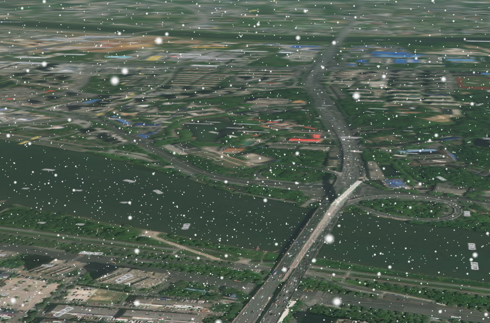
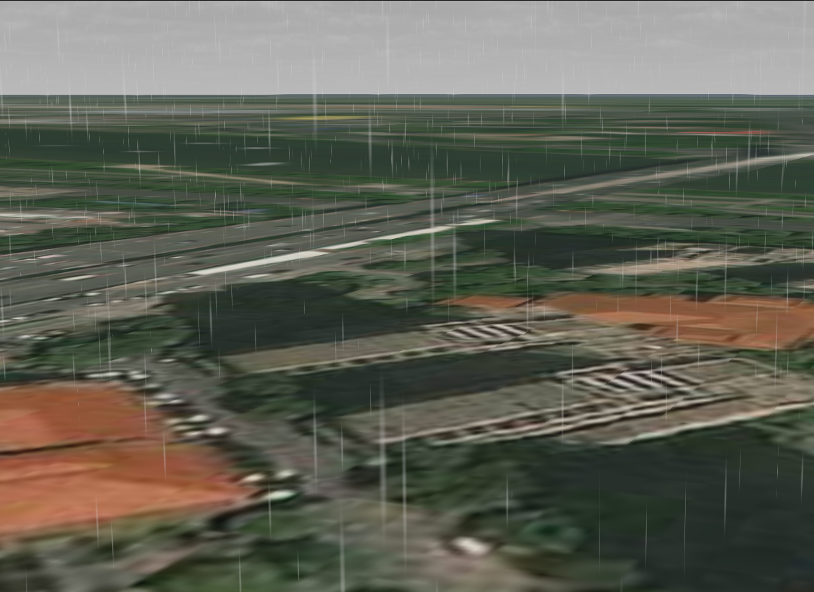
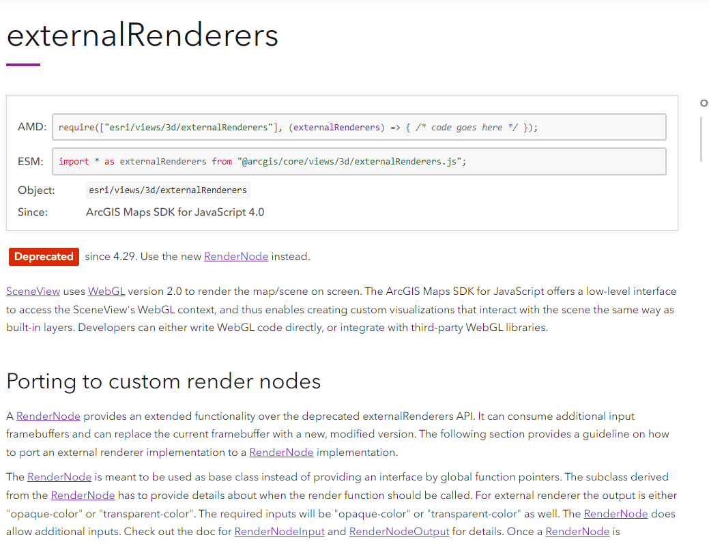

> 这是在 arcgis 官方 api 更新出天气效果前，和同事用 threejs 实现的一个方案，现在已经是历史的尘埃了，整理笔记，贴在这里。




## 原理说明

ArcGIS JS API 在 SceneView(3D)场景下，提供了 `externalRenders` 的 class，暴露了 WebGL context 用于用户扩展实现其他效果。（2024-10 看新的文档，[externalRenders](https://developers.arcgis.com/javascript/latest/api-reference/esri-views-3d-externalRenderers.html) 已经弃用，用新的[RenderNode](https://developers.arcgis.com/javascript/latest/api-reference/esri-views-3d-webgl-RenderNode.html)来实现。看了一眼，大差不差吧。



无论哪种地图引擎，结合ThreeJS，最主要的一步都是两个坐标系之间的同步。

## positionTransform
```ts
import requireArcgis from '../../../../../../utils/requireArcgis';

/**
     * 经纬度转世界坐标
     * @param {number} longitude 经度
     * @param {number} latitude 纬度
     * @param {number} height 高程
     * @returns {Array} 世界坐标系
     */
export function positionTransform(view:__esri.SceneView, longitude: number, latitude: number, height: number): Promise<Array<number>> {
    return requireArcgis([
        'esri/views/3d/externalRenderers',
        'esri/geometry/support/webMercatorUtils',
        'esri/geometry/SpatialReference',
    ]).then(([externalRenderers, webMercatorUtils, SpatialReference]) => {
        const transformation = new Array(16);

        const pointXY = webMercatorUtils.lngLatToXY(longitude, latitude);

        externalRenderers.renderCoordinateTransformAt(
            view,
            [pointXY[0], pointXY[1], height],
            SpatialReference.WebMercator,
            transformation,
        );
        return transformation;
    });

}

```

## 构建threejs场景
```ts
import _ from 'lodash';
import {
    WebGLRenderer,
    Scene,
    PerspectiveCamera,
    Vector3,
    AxesHelper,
    Group,
    DirectionalLight,
    AmbientLight,
    AnimationMixer,
    Clock,
    Mesh,
    ShaderMaterial,
    AnimationAction,
} from 'three';
import requireArcgis from '../../../../../../utils/requireArcgis';

export declare type OptionsType = {
    view: __esri.SceneView;
}
class ThreeRender {
    renderer: WebGLRenderer;
    scene: Scene;
    camera: PerspectiveCamera;
    view: __esri.SceneView;
    snow: Group;
    rain: Group;
    dir_light: DirectionalLight;
    amb_light: AmbientLight;
    isSnow = true;
    isWeather = false;
    isRotate: boolean;
    mixer: AnimationMixer;
    clock: Clock;
    animationActions: AnimationAction[];
    nebula: any;
    circle: Group;
    constructor(options: OptionsType) {
        this.view = options.view;
        this.clock = new Clock();
    }
    setup = (context: __esri.RenderContext | undefined): void => {
        this.renderer = new WebGLRenderer({
            context: context?.gl,
            premultipliedAlpha: false,
        });
        this.renderer.setPixelRatio(window.devicePixelRatio);
        this.renderer.setViewport(0, 0, this.view?.width, this.view?.height);

        this.renderer.autoClearDepth = false;
        this.renderer.autoClearStencil = false;
        this.renderer.autoClearColor = false;

        this.scene = new Scene();
        this.camera = new PerspectiveCamera();
        const axis = new AxesHelper(10000000);
        this.scene.add(axis);
        this.dir_light = new DirectionalLight(0xffffff, 2.5);
        this.amb_light = new AmbientLight(0xffffff, 0.5);
        this.scene.add(this.dir_light);
        this.scene.add(this.amb_light);
        this.amb_light.position.set(-1942417.533565925, 5114161.777474515, 3279564.9596681832);
        this.dir_light.position.set(-1942417.533565925, 5114161.777474515, 3279564.9596681832);
        context?.resetWebGLState();
        this.scene.add(this.camera);
   
        this.camera.add(this.rain);
        this.circle = new Group();
        this.animationActions = [];
        this.scene.add(this.circle);

    };
    render = (context: __esri.RenderContext | undefined): void => {

        if (!context) {
            return ;
        }
        const ArcCamera = context.camera;

        this.camera?.position.set(
            ArcCamera.eye[0],
            ArcCamera.eye[1],
            ArcCamera.eye[2],
        );
        this.camera?.up.set(
            ArcCamera.up[0],
            ArcCamera.up[1],
            ArcCamera.up[2],
        );
        this.camera?.lookAt(
            new Vector3(
                ArcCamera.center[0],
                ArcCamera.center[1],
                ArcCamera.center[2]),
        );
        if (this.circle.children.length > 0) {
            _.each(this.circle.children, c => {
                ((c as Mesh).material as ShaderMaterial).uniforms.time.value +=0.01;
            });
        }
        if (this.mixer) {
            const data = this.clock.getDelta();
            this.mixer.update(data);
        }
        this.camera?.projectionMatrix.fromArray(ArcCamera.projectionMatrix);
        
        if (this.nebula) {
            this.nebula.update();
        }
        this.renderer?.state.reset();

        this.renderer?.render(this.scene, this.camera);
        requireArcgis('esri/views/3d/externalRenderers').then(externalRenderers => {
            externalRenderers.requestRender(this.view);
        });
        context.resetWebGLState();
    };
}
export default ThreeRender;

```

layeRenderer.ts
```ts
sceneView.render = new ThreeRender({'view':sceneView});
requireArcgis('esri/views/3d/externalRenderers').then(externalRenderers=> {
    externalRenderers.add(sceneView, sceneView.render);
    console.log('sceneView',sceneView);
    // do something
});

```
loader.ts
```ts
export function Textureloader(url: string): Texture {
    const textureloader = new TextureLoader();
    return textureloader.load(url);
}

export function createSnow(): Group {
    const snow1 = Textureloader('../assets/snow1.png');
    const snow2 = Textureloader('../assets/snow2.png');
    const snow3 = Textureloader('../assets/snow3.png');
    const snow4 = Textureloader('../assets/snow4.png');
    const snow5 = Textureloader('../assets/snow5.png');
    
    const group = new Group();
    const geometry = new BufferGeometry();
    const vertices = [];
    for (let i = 0; i < 100000; i++) {
        const x = Math.random() * 5000 - 2500;
        const y = Math.random() * 5000 - 2500;
        const z = Math.random() * 5000 - 2500;
        vertices.push(x, y, z);
    }
    geometry.setAttribute('position', new Float32BufferAttribute(vertices, 3)); //设置geometry顶点
    geometry.computeBoundingBox();
    geometry.center();

    const materials = [];
    const params = [
        [[1.0, 0.2, 0.5], snow1, 20 * 2],
        [[0.9, 0.1, 0.5], snow2, 15 * 2],
        [[0.95, 0.05, 0.5], snow3, 10 * 2],
        [[0.85, 0, 0.5], snow4, 30 * 2],
        [[0.8, 0, 0.5], snow5, 25 * 2],
    ];

    for (let i = 0; i < params.length; i++) {
        const [color, texture, size] = params[i];

        materials[i] = new PointsMaterial({
            size: size as number,
            map: texture as Texture,
            blending: AdditiveBlending,
            depthTest: false,
            transparent: true,
            opacity: 1,
        });

        materials[i].color.setHSL(
            (color as Array<number>)[0],
            (color as Array<number>)[1],
            (color as Array<number>)[2],
        );

        const particles = new Points(geometry, materials[i]);
        particles.rotation.x = Math.random() * .6;
        particles.rotation.y = Math.random() * .6;
        particles.rotation.z = Math.random() * .6;

        group.add(particles);
        
    }
    return group;
}
```