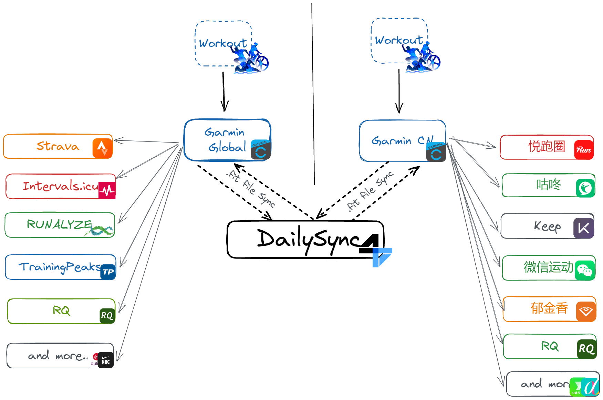
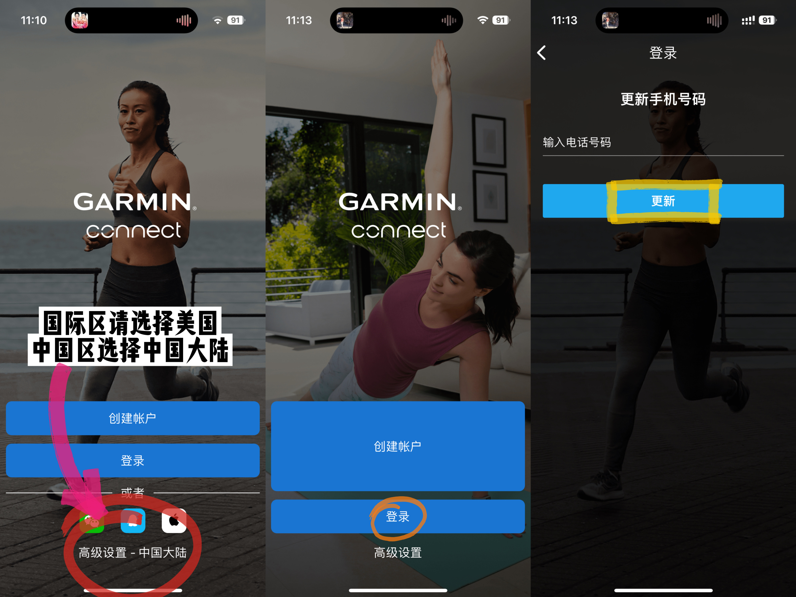
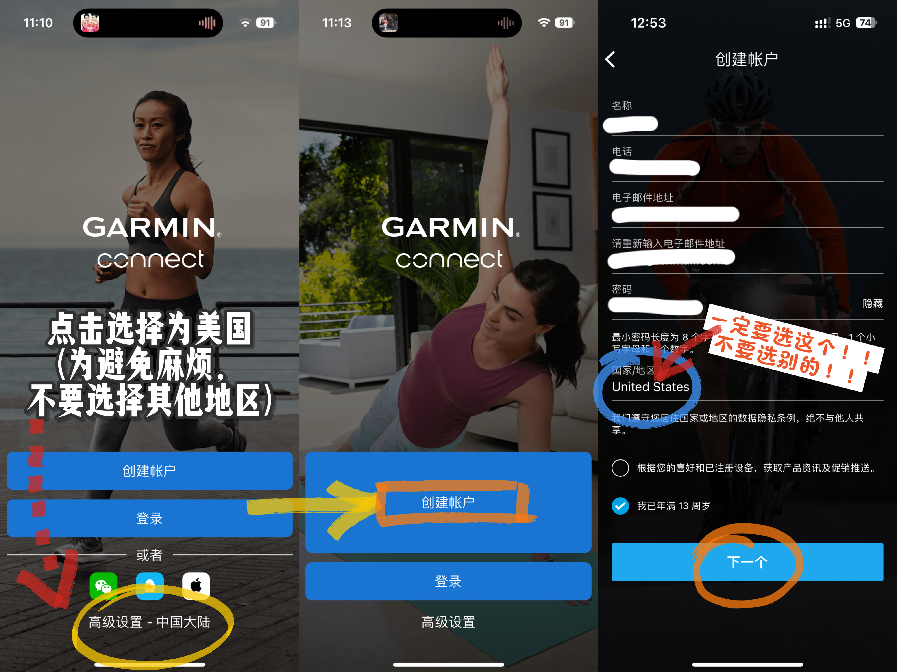
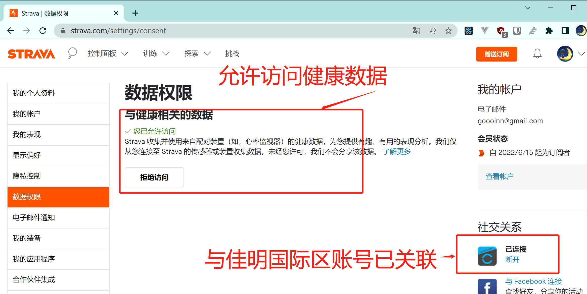
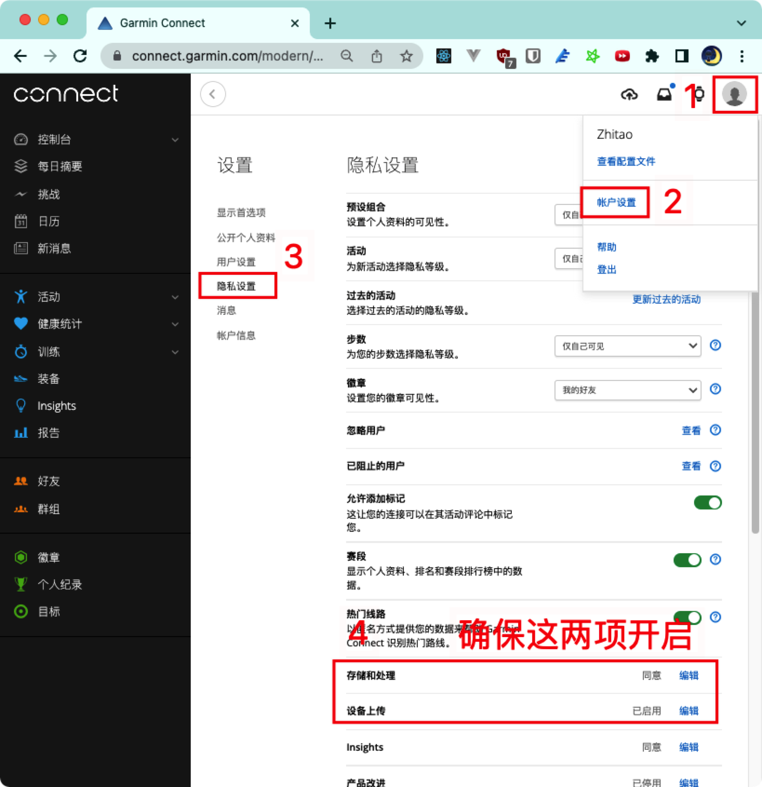
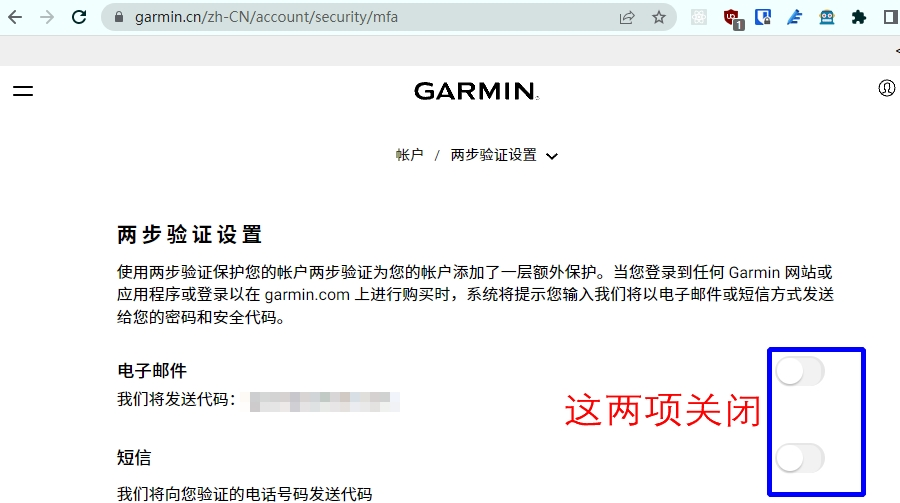

[https://dailysync.vyzt.dev/](https://dailysync.vyzt.dev/)

## 账号准备

> 初次使用，请仔细阅读本文并将按照说明与截图的配置保持一致，否则遇到问题浪费大家时间

> 特别注意： 如果您要新注册国际区账号，区域记得请选择美国（语言可以选择中文），不要注册香港及欧洲国家的，最近在系统中经常无法添加账号

[佳明国际区网址](https://connect.garmin.com/signin/)

[佳明国中国区网址](https://connect.garmin.cn/signin/)

[Strava网址](https://www.strava.com/)

### 佳明网站说明
 ⚠️ 当前佳明Connect有多个网站，请注意看地址栏的网址区分：

### 国际区网址：

[https://connect.garmin.com](https://connect.garmin.com)

佳明中国代理的国际区网址(没有挂梯子访问上面地址会跳转到这个地址)：
[https://connectus.garmin.com](https://connectus.garmin.com)

### 佳明中国区网址
（与上面网址数据隔离）
[https://connect.garmin.cn](https://connect.garmin.cn)

--------
## 注册佳明国际区账号和Strava账号

> 特别注意： 如果您要新注册国际区账号，区域记得请选择 **美国**（语言可以选择中文），不要注册香港及欧洲国家的，最近在系统中经常无法添加账号

### 手机APP验证号码（新注册账号忽略，看下一步）
如果在网页上注册的账号，需要在手机APP上验证手机号码，否则无法验证账号并上传数据
参考下图，点击登录后，填入账号密码，然后点击`登录`，会提示`更新手机号码`，填入手机号更新即可。如果没有弹出更新手机号码的页面，则代表正常。验证完成后，在DailySync上再尝试“立即同步”或者验证佳明账号。

### 手机ConnectAPP 注册账号
在设置中登出当前登录的账号，然后按照图片操作，注册一个新的账号，区域选择美国，并**验证电话号码**

注册好`佳明国际区`的帐号及`Strava`账号

将`Strava`与`佳明国际区`账号关联，并开启Strava数据权限（下图）

## 佳明账号隐私设置(特别重要！！)
如果是新注册的账号，**包括中国区与国际区**，请确保账号隐私设置中的`存储和处理` 是 `同意`状态，`设备上传`是`已启用` 状态(下图)
，否则上传数据会报`412`错误码：`User explicity revoked consent for uploading files.`

## 关闭佳明账号两步验证(一样重要！！)

如果的佳明账号在登录网页版Connect时，需要填入验证码，说明您开启了两步验证，需要关闭此选项才能使用本工具，如果不需要验证码就能登录，可跳过此步骤。

点击下方链接，请按照图中设置关闭

[https://www.garmin.cn/zh-CN/account/security/mfa](https://www.garmin.cn/zh-CN/account/security/mfa)

## 后续使用参考


