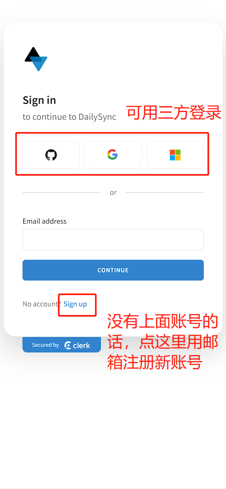
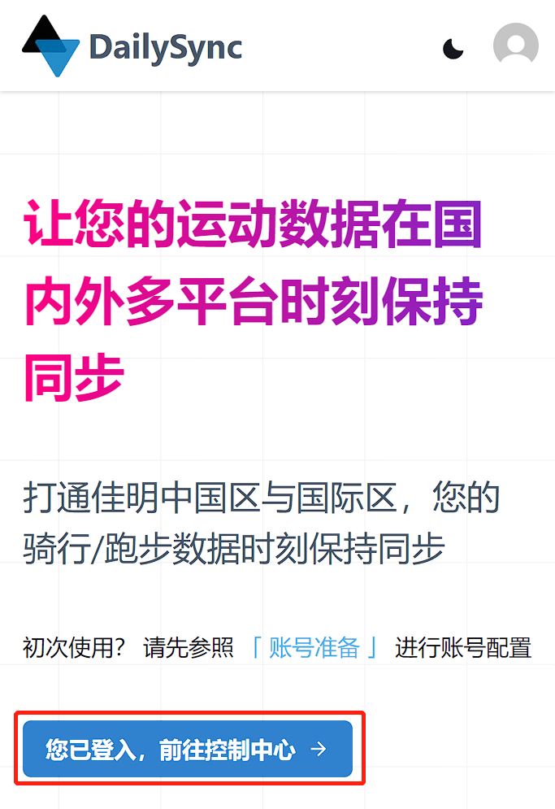
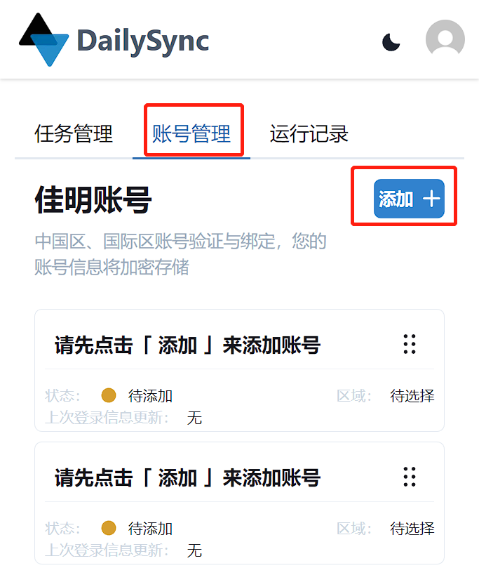
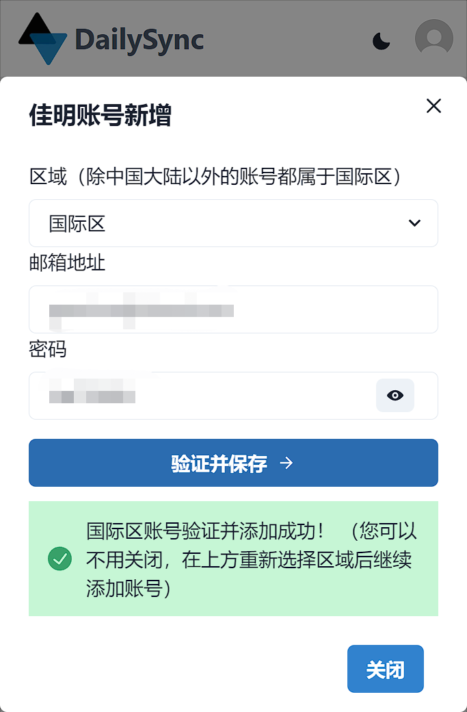
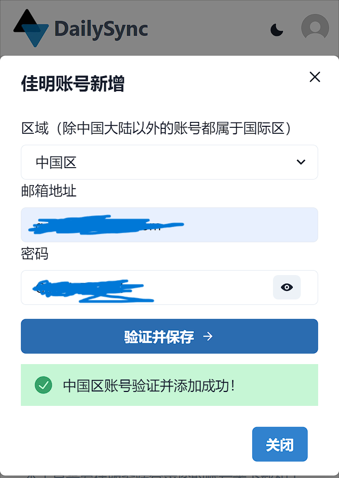
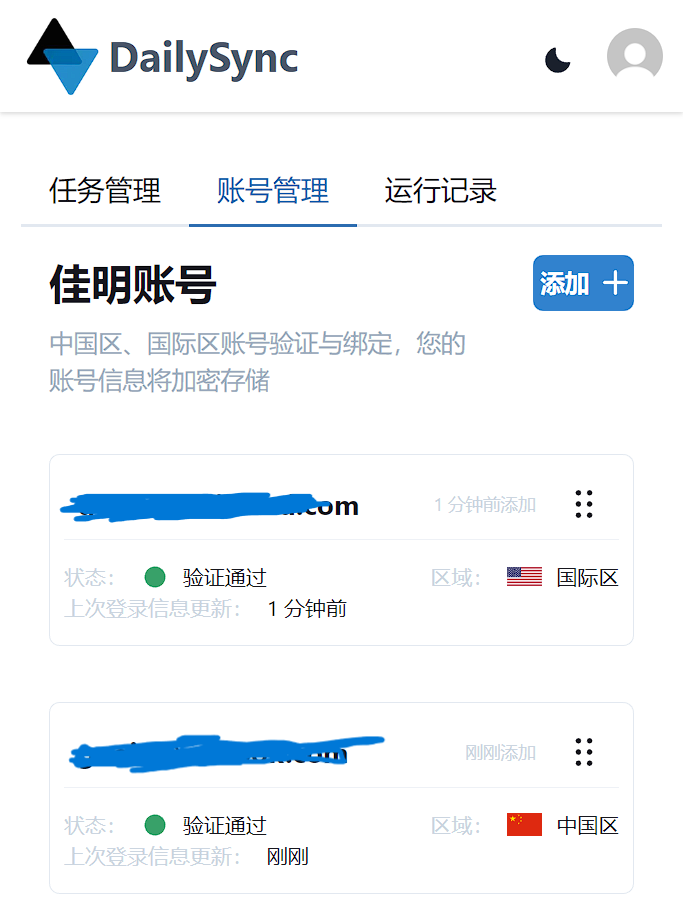
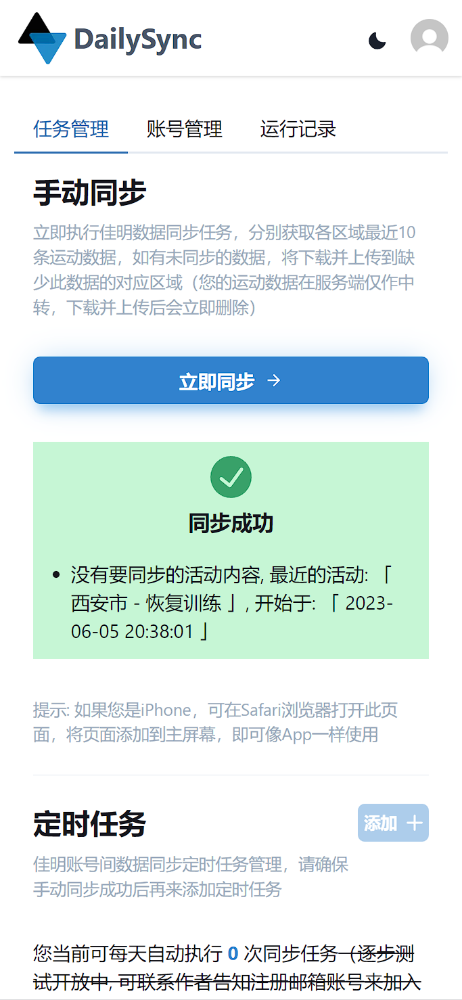
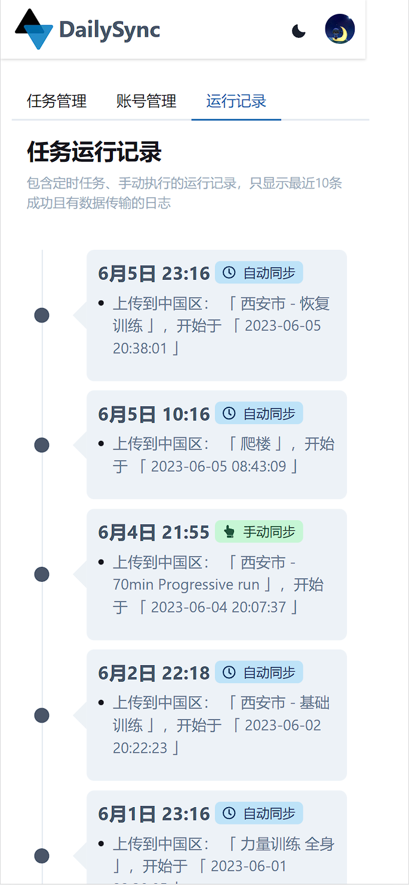
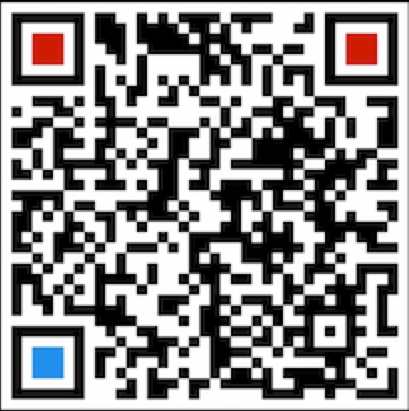

[https://dailysync.vyzt.dev/](https://dailysync.vyzt.dev/)

如果没有国际区佳明账号，请先参考下文，准备所需账号



## Step0

点击右上角`登录`

---

## Step1 注册 DailySync 账号

如果你有谷歌/微软/Github 账号，直接关联登录就可以
没有就用邮箱登录

---

---

登录成功后如下图，点击进入控制中心

---

---

## Step2 绑定账号

---

---

---

---

---

## Step3 执行同步

在任务管理-手动同步下点击立即同步

---

---

同步完成后就能看到同步结果了

**如果你点完显示同步成功，但是下方没有任何文字提示，请参考账号准备页面，检查佳明账号的权限设置！！！**

---

## Step4 同步历史查看

---

---

## 遇到问题?

请联系作者排查问题，感谢！！

[微信二维码扫描]

