海康威视提供了两种主要的视频流接入方案，以满足不同的用户需求和应用场景。
第一种方案是传统的客户端安装方案。在这种方案中，用户需要在他们的设备上下载并安装一个专门的 exe 文件。这个文件包含了与海康威视设备进行通信和接收视频流的所有必要组件。这种方案的优点是稳定性和兼容性强，能够提供全面的功能和高质量的视频流。然而，这也意味着用户需要在他们的设备上安装额外的软件，这可能会对一些用户造成不便。

第二种方案是通过 HTML5 播放器在线播放。这种方案利用了现代浏览器的 HTML5 视频播放能力，允许用户直接在他们的浏览器中观看海康威视的视频流，无需下载或安装任何额外的软件。这种方案的优点是方便快捷，用户可以在任何支持 HTML5 的浏览器中观看视频流。然而，由于依赖于浏览器的视频播放能力，这种方案可能无法提供与传统客户端安装方案相同的功能和视频质量。

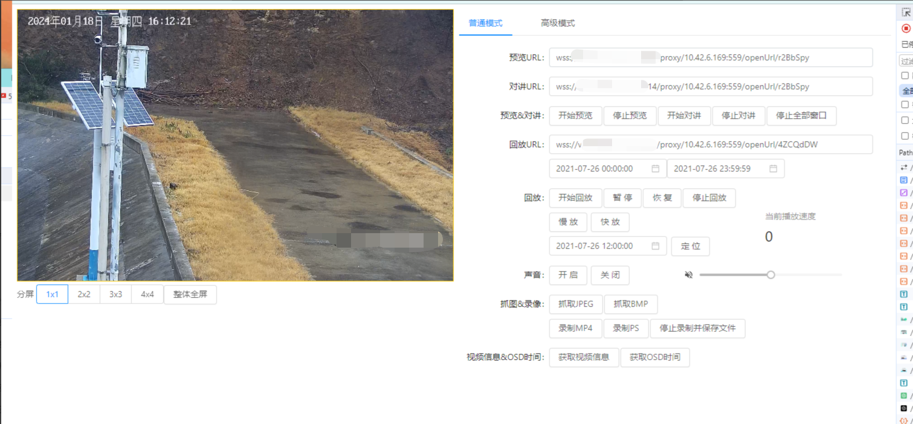

## 起步

一般来说，客户会给到一个链接信息，以及 appKey appSecret
比如下面

```s
地址
https://**.**.**.**:1443
https://v.********.cn:1443

账号：**
密码：**@*****
合作方Key：260*****
合作方Secret：LCqWlRv16JJU*****
```

上面的网址一般是可以进去预览摄像头的，比如这样，确保摄像头能够预览，并且观察 f12 中的网络请求

`https://v.********.cn:1443/vms/ui/webPreview/camera/previewUrl`

找到一个能播放的摄像头 id， 如

`b3a11fc9110a49c1a5ae327911f91d6d  `

并查看这个接口的响应，拿到一个播放地址 ，如

`wss://v.********.cn:6014/proxy/10.42.6.169:559/openUrl/sYvtLEc`

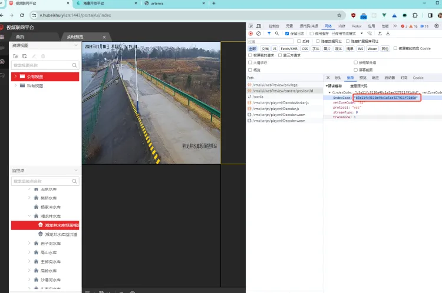

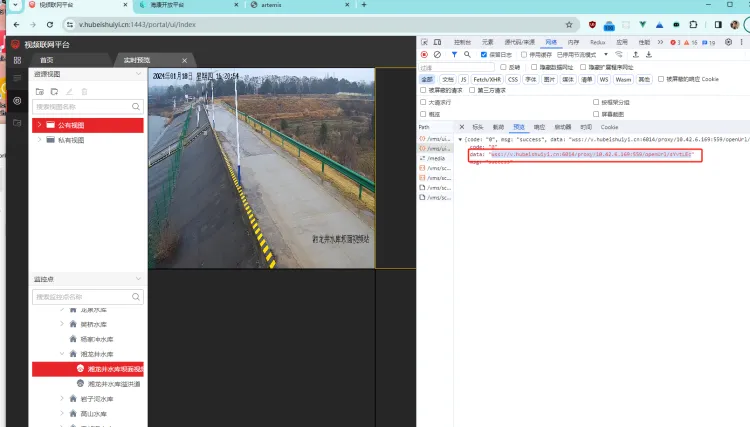

## 下载开发包本地验证视频流地址

https://open.hikvision.com/download/5c67f1e2f05948198c909700?type=20

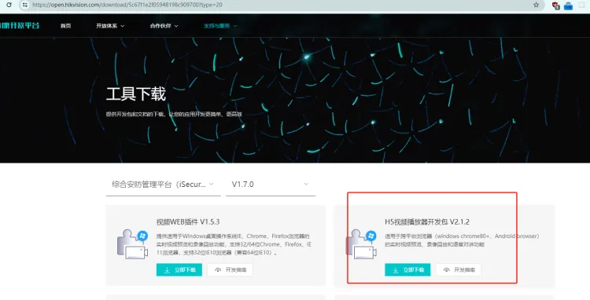

载后安说明运行开发包内 demo.html
将上一步拿到的 视频地址，在页面上填入，然后点击 【开始预览】

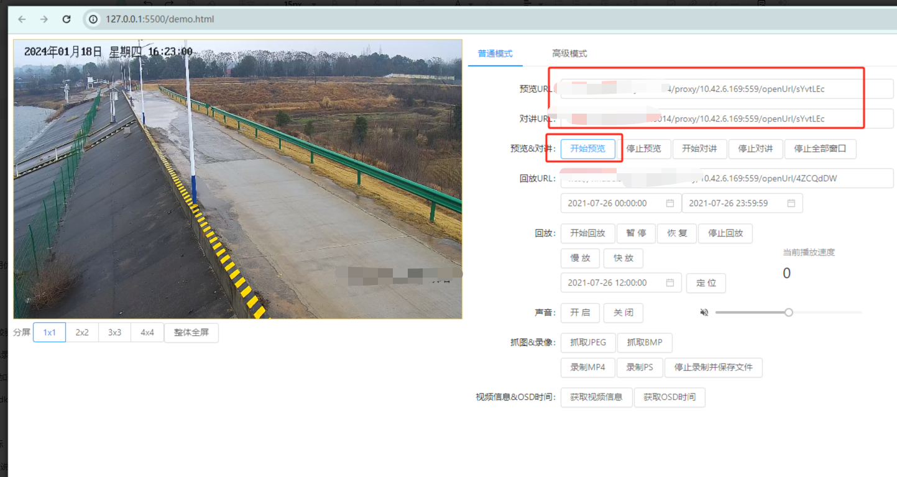

如果这里正常就就可以进行下一步。通过 API 接口来获取播放地址。（ps： 上面的 api 地址 `https://v.******.cn:1443/vms/ui/webPreview/camera/previewUrl` 是平台用的，需要鉴权才能使用。开发对接需要通过 appKey 和 appSecret 来进行）

## 进行对接

### 海康的参考文档

api 认证：

https://open.hikvision.com/docs/docId?productId=5c67f1e2f05948198c909700&version=%2Ff95e951cefc54578b523d1738f65f0a1&tagPath=%E5%8D%8F%E8%AE%AE%E6%A6%82%E8%BF%B0-%E6%8E%A5%E5%8F%A3-%E8%B0%83%E7%94%A8%E8%AE%A4%E8%AF%81

获取监控点预览取流 URLv2：

https://open.hikvision.com/docs/docId?productId=5c67f1e2f05948198c909700&version=%2Ff95e951cefc54578b523d1738f65f0a1&tagPath=API%E5%88%97%E8%A1%A8-%E8%A7%86%E9%A2%91%E5%BA%94%E7%94%A8%E6%9C%8D%E5%8A%A1-%E8%A7%86%E9%A2%91%E8%83%BD%E5%8A%9B

### debug 页面

海康提供了一个在线 debug 页面，可以方便的使用 APPkey 和 APPsecret 进行接口测试

`https://v.******.cn:1443/artemis-web/debug/index`

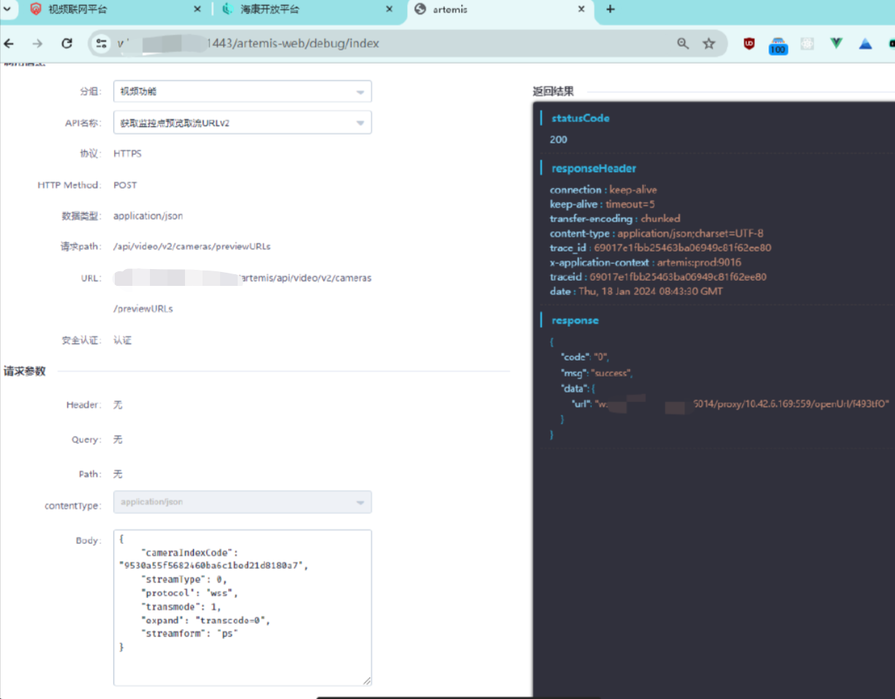

debug 的请求像这样

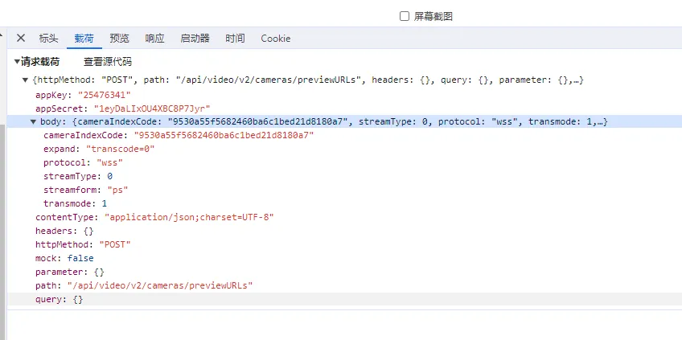

调试通过后，我们就可以用代码来请求 api 了

### postman 脚本

下载下面的 postman 脚本并导入（zip 中有如何导入的教程）

可以看到实际鉴权加的 header 是通过脚本计算的，所以需要把计算 header 的这些代码搬到项目代码中。

`x-ca-key` 是提供的 appKey
脚本中的 `secret` 是提供的 appSecret

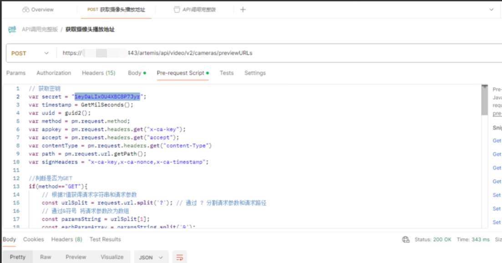

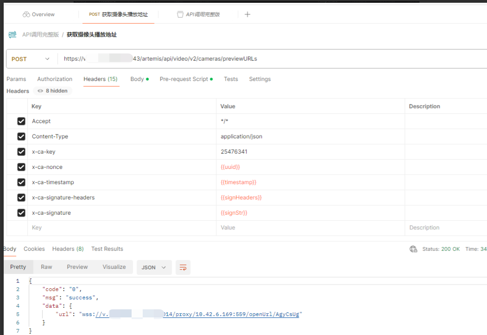

进行调用即可

### 计算 header 的脚本

adaptor.ts

```ts
import _ from "lodash";
import axios, { AxiosRequestConfig } from "axios";
import { AdaptorResultType, BaseAdaptor } from "@****/**-core";
import schema from "./schema";
import { createHikvisionHeader } from "./util";

type ResponseType = {
  code: string;
  msg: string;
  data: {
    url: string;
  };
};

class Adaptor extends BaseAdaptor {
  static schema = schema;

  async execute(): Promise<AdaptorResultType | undefined> {
    try {
      // eslint-disable-next-line @typescript-eslint/ban-ts-comment
      // @ts-ignore
      const { videoConfig } = this.globalParams.variables;
      const { id } = this.getRealParams();
      if (_.isEmpty(videoConfig) || _.isEmpty(id)) {
        throw new Error("视频配置为空或没有获取到摄像头id，请检查");
      }
      const {
        baseUrl,
        appKey,
        appSecret,
        routes: { previewURLs },
      } = videoConfig;

      const config: AxiosRequestConfig = {
        method: "POST",
        url: `${baseUrl}${previewURLs}`,
        withCredentials: false,
        headers: {
          Accept: "*/*",
          // 'Accept-Encoding': 'gzip, deflate, br',
          "Content-Type": "application/json",
          "x-ca-key": appKey,
          ...createHikvisionHeader(
            "POST",
            `${baseUrl}${previewURLs}`,
            appSecret,
            appKey
          ),
        },
        data: {
          cameraIndexCode: id,
          streamType: 0,
          protocol: "wss",
          transmode: 1,
          expand: "transcode=0",
          streamform: "ps",
        },
      };
      const res = await axios.request<ResponseType>(config);
      // console.log('=>(Adaptor.ts:58) res', res);

      if (_.get(res, "data.code") !== "0") {
        throw new Error(res.data.msg);
      }
      return { data: res.data.data.url } as AdaptorResultType;
    } catch (err) {
      this.pushError({ message: (err as Error).message });
      throw err;
    }
  }
}

export default Adaptor;
```

util.ts

```ts
import CryptoJS from "crypto-js";
// console.log('crypto:', CryptoJS);

export function createHikvisionHeader(
  method: string,
  url: string,
  secret: string,
  appkey: string
): Record<string, string> {
  const timestamp = new Date().getTime();
  const uuid = guid2();
  const path = getPathFromUrl(url, method);
  const contentType = "application/json";
  const accept = "*/*";
  const signHeaders = "x-ca-key,x-ca-nonce,x-ca-timestamp";
  const message = `${method}\n${accept}\n${contentType}\nx-ca-key:${appkey}\nx-ca-nonce:${uuid}\nx-ca-timestamp:${timestamp}\n${path}`;
  const signStr = sign(message, secret);

  return {
    "x-ca-signature": signStr,
    "x-ca-key": appkey,
    "x-ca-nonce": uuid,
    "x-ca-timestamp": String(timestamp),
    "x-ca-signature-headers": signHeaders,
    Accept: accept,
    "Content-Type": contentType,
  };
}

function getPathFromUrl(url: string, method: string): string {
  if (method === "GET") {
    const urlObj = new URL(url);
    const params = new URLSearchParams(urlObj.search);
    const sortedParams = new URLSearchParams(
      Array.from(params.entries()).sort()
    );
    return urlObj.pathname + "?" + sortedParams.toString();
  } else {
    return new URL(url).pathname;
  }
}

function guid2() {
  function S4() {
    return (((1 + Math.random()) * 0x10000) | 0).toString(16).substring(1);
  }
  return (
    S4() +
    S4() +
    "-" +
    S4() +
    "-" +
    S4() +
    "-" +
    S4() +
    "-" +
    S4() +
    S4() +
    S4()
  );
}

function sign(signString: string, secret: string): string {
  return CryptoJS.enc.Base64.stringify(CryptoJS.HmacSHA256(signString, secret));
}
```

config.js

```js
videoConfig: {
    // 这个地址会跨域，需要nginx转发
    // baseUrl: 'https://v.******.cn:1443',
    // nginx转发的地址，转发配置在 /nginx/release.conf下
    baseUrl: 'http://127.0.0.1',
    appKey: '2547****',
    appSecret: '1eyDaLIxOU4********',
    routes: {
        previewURLs: '/artemis/api/video/v2/cameras/previewURLs',
    },
},
```

### 注意事项

1、有的接口做了跨域限制，浏览器会无法请求，这个时候只能配置 nginx 转发来做
2、通过 webpack 转发接口，浏览器直接发送请求，会报个 406 代码， 还是通过 nginx 转发来解决，或者后端写个接口转发一下
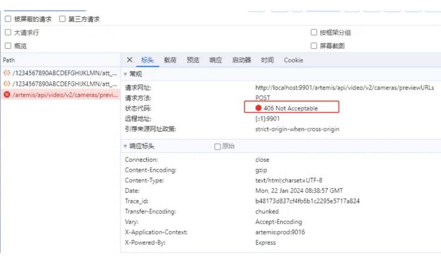

转发 nginx 配置

```conf
        location ^~ /artemis/ {
            if ($request_method = 'OPTIONS') {
                add_header 'Access-Control-Allow-Origin' '*' always;
                add_header 'Access-Control-Allow-Methods' 'GET, POST, OPTIONS' always;
                add_header 'Access-Control-Allow-Headers' 'DNT,User-Agent,X-Requested-With,If-Modified-Since,Cache-Control,Content-Type,Range,X-Ca-Key,X-Ca-Nonce,X-Ca-Signature,X-Ca-Signature-Headers,X-Ca-Timestamp' always;
                add_header 'Access-Control-Max-Age' 1728000;
                add_header 'Content-Type' 'text/plain; charset=utf-8';
                add_header 'Content-Length' 0;
                return 204;
            }
            add_header 'Access-Control-Allow-Origin' '*' always;
            add_header 'Access-Control-Allow-Methods' 'GET, POST, OPTIONS' always;
            add_header 'Access-Control-Allow-Headers' 'DNT,User-Agent,X-Requested-With,If-Modified-Since,Cache-Control,Content-Type,Range,X-Ca-Key,X-Ca-Nonce,X-Ca-Signature,X-Ca-Signature-Headers,X-Ca-Timestamp' always;
            add_header 'Access-Control-Expose-Headers' 'Content-Length,Content-Range' always;
            proxy_set_header X-Real-IP $remote_addr;
            proxy_set_header X-Forwarded-For $proxy_add_x_forwarded_for;
            proxy_set_header Referer "";
            proxy_pass https://v.******.cn:1443/artemis/;
        }
```

### 实现效果（低代码）

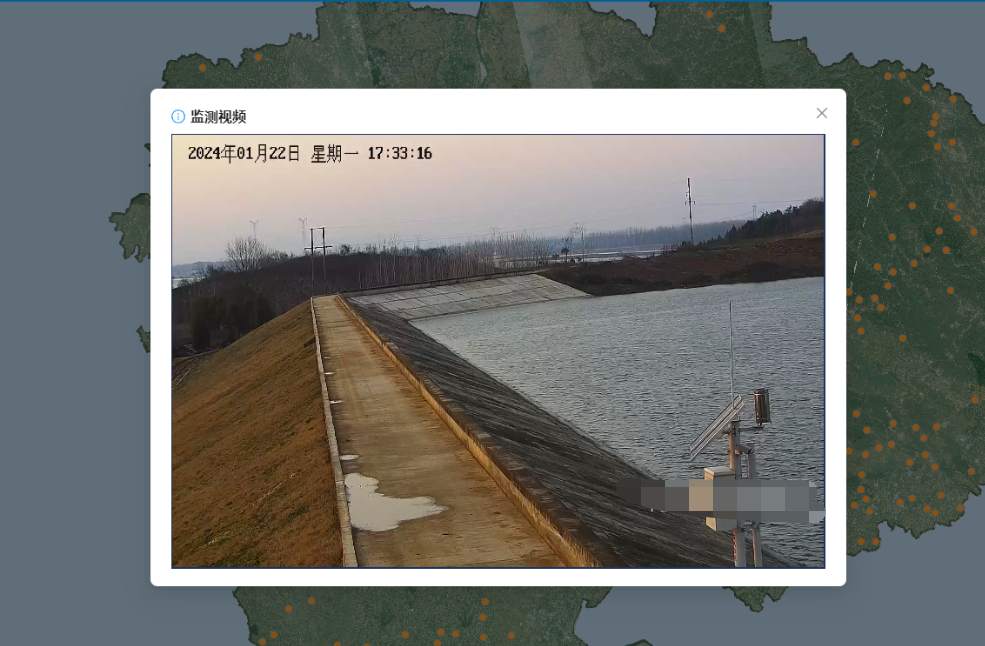
