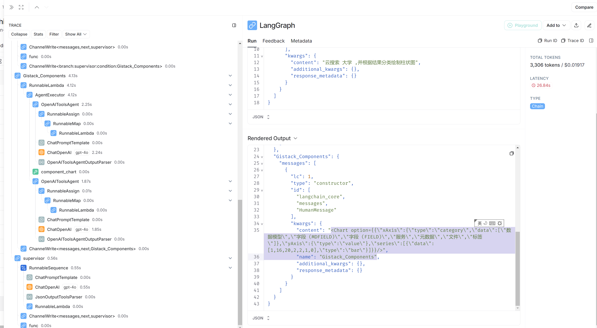
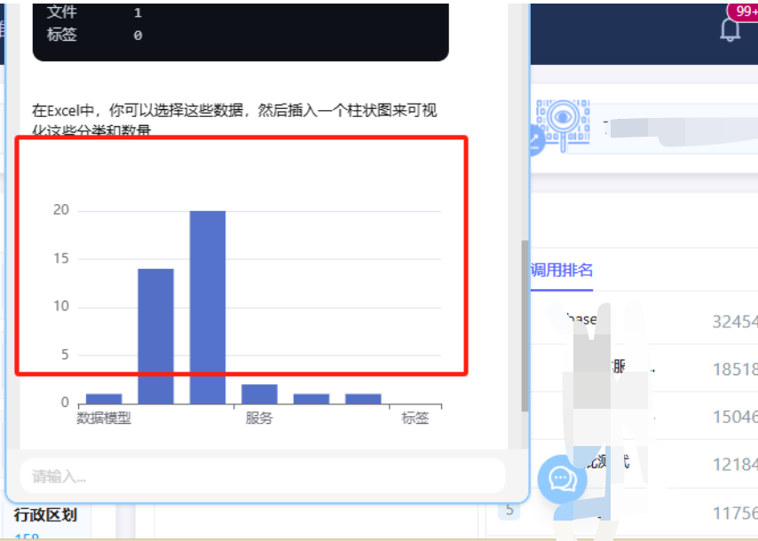
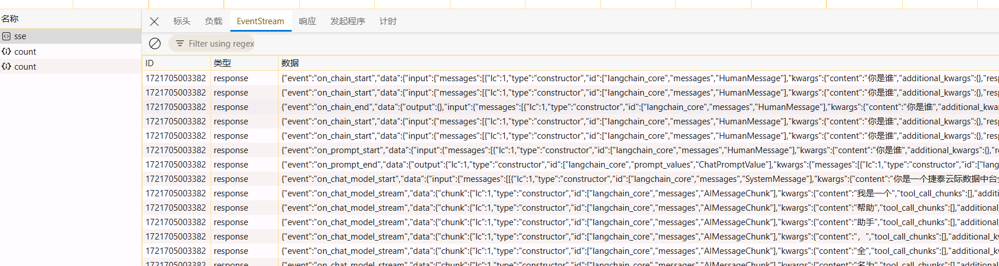

LangChain 和 LangGraph 是两个用于构建和管理与大语言模型（Large Language Models, LLMs）互动的工具。

LangChain 是一个用于将不同的语言模型和自然语言处理（NLP）工具链集成到一个统一框架中的工具。它允许开发者更方便地结合和切换不同的语言模型，以及利用各种预处理和后处理模块。LangChain 的目标是提供一个灵活的、可扩展的工具集，以简化开发者在构建复杂语言应用程序时的工作。

LangGraph 是一个用于构建和管理复杂语言模型工作流的图形化工具。它通过图形界面和底层 API，使得用户能够直观地设计和管理各种任务流（workflow），这些任务流可以包含多个步骤和条件，以便更好地实现复杂的语言处理任务。

> 本文是对接 llm 监管模式的一个示例流程代码，调用多 agent 实现组合功能。

1. 实现 midwayjs 接口对接 langgraph 的流式传输
2. langgraph 自定义 tool 对接私有 api、并生成目标响应内容
3. langgraph 实现 supervisor 监管模式，按任务要求分配不同的执行任务 Agent
4. 前端渲染显示生成的内容并用 React 组件呈现

剩下要做的点有：

1. 对接向量模型，实现内部知识库。
2. 基于开源模型微调，构建一个内部行业的大模型

以上只是美好的梦想罢了，哈哈，没有机器，也没有时间，没法玩儿下去了。

## 实现方法

### 后端

使用 `langchain` `langgraph` `midwayjs` 实现

- supervisor 监管者根据问题分配要执行的 Agent
- 假设有 2 个 Agent
  - Agent1 配合多个 tools，实现查询内部的多个接口，返回接口的一些统计数据
  - Agent2 实现生成 react 组件文本内容，如绘制图表，生成表格等
- 使用示例：`查询有多少元数据，并绘制柱状图`

  执行过程：
  supervisor -> agent 1 -> supervisor -> agent 2

  查看调用过程： [langsmith](https://smith.langchain.com/o/4ab3a5a2-99b9-5349-ad27-20606f2f87c5/projects/p/897d4336-827b-4100-8394-c18f8ca126a0?peek=1adae0c7-0b53-4e25-8c05-584d74bf80a7)
  

> PS:当时 midwayjs 不支持流式传输（SSE）,研究了一下提供了一个可行的方案。参考[https://github.com/midwayjs/midway/issues/3282#issuecomment-2252190084](https://github.com/midwayjs/midway/issues/3282#issuecomment-2252190084)

### 前端

前端渲染并不想只要文字显示，要有能力来渲染出来丰富的 React 组件。



解决的方案就是大模型返回 React 组件的格式.

```tsx
<Chart data={someChartData}/>
<Table data={someTableData}/>
```

前端提前写好或者导入模型返回的组件,如`Chart`,`Table`等

借助`MDX`，将模型返回内容作为`MDX`的文本内容，调用 `MDX` 的能力编译显示为页面。

## 说明

监管模式对大模型能力要求较高，当时调试国内的 llm 模型在分配任务的时候通常无法准确分配执行任务的 agent。gpt4-o 则一路顺畅。

## 核心代码

graph.ts

````ts
import { BaseMessage, HumanMessage } from "@langchain/core/messages";
import {
  ChatPromptTemplate,
  MessagesPlaceholder,
} from "@langchain/core/prompts";
import { getEnvironmentVariable } from "@langchain/core/utils/env";
import { zodToJsonSchema } from "zod-to-json-schema";

import { AgentExecutor, createOpenAIToolsAgent } from "langchain/agents";
import { Runnable, RunnableConfig } from "@langchain/core/runnables";
import {
  CompiledStateGraph,
  END,
  START,
  StateGraph,
  StateGraphArgs,
} from "@langchain/langgraph";
import { ChatOpenAI } from "@langchain/openai";
import { z } from "zod";
import { JsonOutputToolsParser } from "@langchain/core/output_parsers/openai_tools";

// @ts-ignore
import {
  blank,
  prompt_chart,
  prompt_table,
  request_metadata_list,
  cloud_search_statistics,
  request_token,
} from "./tools";
import { ILangChainConfig, ILLMConfig } from "../interface";

interface AgentStateChannels {
  messages: BaseMessage[];
  next: string;
}

const getLLM = (llmConfig?: ILLMConfig): ChatOpenAI => {
  const defaultConfig = {
    temperature: 0, // 控制生成文本的随机性，0表示最确定性的输出
    presencePenalty: 0, // 控制模型不重复已经说过的内容，0表示不施加惩罚
    frequencyPenalty: 0, // 控制模型不过度使用某些词语，0表示不施加惩罚
    topP: 0.9, // 控制生成文本的多样性，0.9表示考虑概率最高的90%的词
    streaming: true, // 启用流式输出，允许逐步接收生成的文本
  };

  if (!llmConfig) {
    const azureModel = getEnvironmentVariable(
      "AZURE_OPENAI_API_DEPLOYMENT_NAME"
    );
    if (!azureModel) {
      throw new Error("未在.env文件中找到Azure OpenAI配置");
    }
    return new ChatOpenAI({
      model: azureModel,
      ...defaultConfig,
      temperature: 0.7,
    });
  }

  const {
    model = getEnvironmentVariable("OPENAI_MODEL"),
    apiKey,
    baseUrl,
  } = llmConfig;

  return new ChatOpenAI({
    model,
    apiKey,
    ...defaultConfig,
    configuration: baseUrl ? { baseURL: baseUrl } : undefined,
  });
};

export const initGraph = async (
  config: ILangChainConfig
): Promise<CompiledStateGraph<AgentStateChannels, unknown, string>> => {
  const { llm: _llmConfig, llms: llmsConfig, system: systemConfig } = config;

  const apiHost =
    systemConfig.apiHost ?? getEnvironmentVariable("SYSTEM_APIHOST");
  const token =
    systemConfig.systemToken ?? getEnvironmentVariable("SYSTEM_TOKEN");

  // const llm_supervisor = getLLM();
  const llm_supervisor = getLLM(llmsConfig.qianwen);
  const llm = getLLM(llmsConfig.glm);

  console.log("=======================");
  console.log("model: ", llm.model);
  console.log("=======================");

  const agentStateChannels: StateGraphArgs<AgentStateChannels>["channels"] = {
    messages: {
      value: (x?: BaseMessage[], y?: BaseMessage[]) =>
        (x ?? []).concat(y ?? []),
      default: () => [],
    },
    next: {
      value: (x?: string, y?: string) => y ?? x ?? END,
      default: () => END,
    },
  };

  async function createAgent(
    llm: ChatOpenAI,
    tools: any[],
    systemPrompt: [string, string][]
  ): Promise<Runnable> {
    // console.log("=>(graph.ts:42) systemPrompt", systemPrompt);
    // Each worker node will be given a name and some tools.
    const prompt = await ChatPromptTemplate.fromMessages([
      ...systemPrompt,
      new MessagesPlaceholder("messages"),
      new MessagesPlaceholder("agent_scratchpad"),
    ]);
    const agent = await createOpenAIToolsAgent({ llm, tools, prompt });
    return new AgentExecutor({ agent, tools });
  }

  const members = ["SAMPLE_API", "SAMPLE_Components"];
  const systemPrompt =
    "你是一个全能助手。" +
    "你是负责管理以下工作人员之间对话的监督员：{members}。 " +
    "鉴于以下用户请求，请回应接下来应该行动的工作人员。 " +
    "每位工作人员将执行一个任务，并回应他们的结果和状态。 " +
    "当完成后，请回应“FINISH”。 ";

  const options = [END, ...members];

  const routeSchema = z.object({
    next: z.enum([END, ...members]).describe("下一个执行任务的工作人员"),
  });
  // console.log("=>(graph.ts:94) routeSchema", routeSchema);
  const functionDef = {
    name: "route",
    description: "选择下一个执行任务的工作人员",
    parameters: zodToJsonSchema(routeSchema),
  };
  const toolDef = {
    type: "function",
    function: functionDef,
  } as const;

  const prompt = ChatPromptTemplate.fromMessages([
    ["system", systemPrompt],
    ["user", "使用route工具来执行，不要直接响应，必须使用工具调用进行响应"],
    new MessagesPlaceholder("messages"),
    [
      "system",
      "鉴于以上对话，接下来谁应该行动？选择下一个要使用的角色？" +
        "还是我们应该结束？从以下选项中选择一个：{options}。",
    ],
  ]);

  const formattedPrompt = await prompt.partial({
    options: options.join(", "),
    members: members.join(", "),
  });

  const apiAgent = await createAgent(
    llm,
    [request_token, request_metadata_list, cloud_search_statistics],
    [
      [
        "system",
        "你是一个API调用的Agent。" +
          `你的系统域名(apiHost)是:'${apiHost}'` +
          "你可以根据用户需要，调用系统提供的各种接口来查询相关的信息。" +
          `当前系统token为:'${token}'` +
          "不要对数据进行修改和调整，我不需要你的代码示例。" +
          "你查询到的信息可以在下一步提供给其他团队工具用于进一步处理。",
      ],
    ]
  );

  const supervisorChain = formattedPrompt
    .pipe(
      llm_supervisor.bindTools([toolDef], {
        // tool_choice: "auto",
        tool_choice: { type: "function", function: { name: "route" } },
        // tool_choice: {"name": "route"},
      })
    )
    .pipe(new JsonOutputToolsParser())
    .pipe((x) => {
      return x[0].args;
    });

  const apiNode = async (
    state: AgentStateChannels,
    config?: RunnableConfig
  ) => {
    const result = await apiAgent.invoke(state, config);
    return {
      messages: [
        new HumanMessage({ content: result.output, name: "SAMPLE_API" }),
      ],
    };
  };

  console.log("prompt_table", prompt_table);
  console.log("prompt_chart", prompt_chart);
  const componentsAgent = await createAgent(
    llm,
    [blank],
    [
      [
        "system",
        "你是一个根据参数创建的React组件字符串的Agent。" +
          "你可以根据上下文的数据内容，创建一个React组件的字��串。" +
          "当需要创建组件时，你应当优先考虑采用Antd的组件库来创建。" +
          "" +
          prompt_table +
          prompt_chart +
          "我不需要你的import和export语句，我是需要代码内容，我自己会处理这些相关格式。" +
          "不要将答案中的代码声明为代码块```，你需要返回纯文本，而不是markdown格式。",
      ],
    ]
  );

  const componentsNode = async (
    state: AgentStateChannels,
    config?: RunnableConfig
  ) => {
    const result = await componentsAgent.invoke(state, config);
    return {
      messages: [
        new HumanMessage({ content: result.output, name: "SAMPLE_Components" }),
      ],
    };
  };

  // 1. Create the graph
  const workflow = new StateGraph<AgentStateChannels, unknown, string>({
    channels: agentStateChannels,
  }) // 2. Add the nodes; these will do the work
    .addNode("SAMPLE_Components", componentsNode)
    .addNode("SAMPLE_API", apiNode)
    .addNode("supervisor", supervisorChain);

  // 3. Define the edges. We will define both regular and conditional ones
  // After a worker completes, report to supervisor
  members.forEach((member) => {
    workflow.addEdge(member, "supervisor");
  });

  workflow.addConditionalEdges("supervisor", (x: AgentStateChannels) => x.next);

  workflow.addEdge(START, "supervisor");

  const graph = workflow.compile();

  return graph;
};
````

API Agent 例子，大差不差，请求调用系统的 api

cloud_search_statistics.ts

```ts
import { DynamicStructuredTool } from "@langchain/core/tools";
import fetch from "node-fetch";
import { z } from "zod";

const schema = z.object({
  keyword: z.string().describe("查询关键字"),
  apiHost: z.string().describe("系统地址apiHost"),
  token: z.string().describe("系统token,如果没有就调用request_token工具来获取"),
});

export const request_metadata_list = new DynamicStructuredTool({
  name: "request_metadata_list",
  description:
    "一个工具，用于根据给出的关键字查询数据的信息" +
    "如果没有系统token,就调用request_token工具来获取",
  schema: schema,
  func: async ({ keyword, apiHost, token }) => {
    const url = `${apiHost}/api/metadata/metadata/list`;
    const body = {
      datalayer: ["APP"],
      keyword,
      filedCountFlag: false,
      domainDataFlag: false,
      lableDataFlag: false,
      standardDataFlag: false,
      pg: {
        a: true,
        i: 1,
        n: 10,
        s: [
          {
            asc: false,
            key: "modified",
          },
          {
            asc: false,
            key: "created",
          },
        ],
      },
    };
    const headers = {
      "Content-Type": "application/json",
      Authorization: token,
    };
    console.log("=>(request_metadata_list.ts:18) url", url);
    try {
      const response = await fetch(url, {
        method: "POST",
        headers,
        body: JSON.stringify(body),
      });
      // console.log('_call - response:', response)
      if (response.ok) {
        const result = await response.json();
        // console.log('_call - reuslt:', result)
        if (result.code === 50007) {
          throw new Error(
            `Request failed with status code ${result.code} Token过期`
          );
        }
        return JSON.stringify(result);
      } else {
        throw new Error(`Request failed with status code ${response.status}`);
      }
    } catch (error) {
      return `Error: ${error}`;
    }
  },
});
```

在 代码 Agent 上，一开始用的 tool 方式来实现，后面发现提示词更好用也更明确，贴一下提示词

> 注意这个地方 react 代码的提示词， langchain 会把 {} 包起来的地方当作变量，所有这个地方转换为了 {{}},存在大括号 {} 的问题，这些大括号会被 LangChain 识别为模板变量的标记符。你需要使用双大括号 {{ }} 来转义大括号，以确保 LangChain 不会误将其识别为模板变量标记符。

```ts
// 注意这个地方react代码的提示词， langchain会把 {} 包起来的地方当作变量，所有这个地方转换为了 {{}}
// 存在大括号 {} 的问题，这些大括号会被 LangChain 识别为模板变量的标记符。你需要使用双大括号 {{ }} 来转义大括号，以确保 LangChain 不会误将其识别为模板变量标记符。

export const prompt_chart = `你可以创建图表，图表采用Echarts，图表可以是Echarts的任何图表，如柱状图，饼图，折线图等。
下面是一个折线图的示例：
<Chart
  option={{=
    xAxis: {{
      type: 'category',
      data: ['Mon', 'Tue', 'Wed', 'Thu', 'Fri', 'Sat', 'Sun']
    }},
    yAxis: {{
      type: 'value'
    }},
    series: [
      {{
        data: [150, 230, 224, 218, 135, 147, 260],
        type: 'line'
      }}
    ]
  }}
/>

下面是一个柱状图的示例：
<Chart
  option={{
    xAxis: {{
      type: 'category',
      data: ['Mon', 'Tue', 'Wed', 'Thu', 'Fri', 'Sat', 'Sun']
    }},
    yAxis: {{
      type: 'value'
    }},
    series: [
      {{
        data: [120, 200, 150, 80, 70, 110, 130],
        type: 'bar'
      }}
    ]
  }}
/>

`;
```

Midway.js 调用

service.ts

```ts
// import { Config,ScopeEnum,Scope,Provide } from '@midwayjs/decorator';
import { Module, ServiceError } from "@gistack/dicode-midway-common";
import { Config } from "@midwayjs/decorator";
import { IChatContent } from "./interface";
import { initGraph } from "./langgraph/graph";
import { HumanMessage } from "@langchain/core/messages";
import { IterableReadableStream } from "@langchain/core/utils/stream";
import { StreamEvent } from "@langchain/core/tracers/log_stream";
@Module()
export class LangChainService {
  @Config("ai.langchain")
  langChainConfig;

  token: string;
  tokenExpires: number;

  async getGraphStreamEvents(
    data: IChatContent
  ): Promise<IterableReadableStream<StreamEvent>> {
    // console.log('this',this.langChainConfig);

    try {
      const graph = await initGraph(this.langChainConfig);
      const streamResults = graph.streamEvents(
        {
          messages: [
            new HumanMessage({
              content: data.content,
            }),
          ],
        },
        {
          recursionLimit: 10,
          version: "v2",
        }
      );
      return streamResults;
    } catch (error) {
      console.error(error);
      throw new ServiceError(error.message);
    }
  }
}
```

controller.ts

```ts
import {
  BaseController,
  StreamMiddleware,
} from "@gistack/dicode-midway-common";
import { Body, Controller, Inject, Post } from "@midwayjs/decorator";
import { ApiBody, ApiOperation, ApiTags } from "@midwayjs/swagger";
import "dotenv/config";
import { IChatContent } from "./interface";
import { LangChainService } from "./service";

@ApiTags(["langchain"])
@Controller("/dicode/api/ai/langchain", { middleware: [StreamMiddleware] })
export class LangChainServiceController extends BaseController {
  @Inject()
  service: LangChainService;

  @Post("/chat")
  @ApiOperation({
    summary: "langgraph智能对话",
  })
  @ApiBody({
    schema: {
      type: "object",
      properties: {
        content: { type: "string" },
      },
      required: ["content"],
      example: {
        content: "你能干什么，下一步调用工具直接结束",
      },
    },
  })
  async chat(@Body() data: IChatContent) {
    // console.log('chat - data:', data)
    // console.log('chat - data:', data.content)
    const streamResults = await this.service.getGraphStreamEvents(data);
    try {
      for await (const output of streamResults) {
        // console.log("-----\n");
        // const result = JSON.stringify(output);
        // console.log(result);
        this.ctx.sse.send(output);
        // console.log("-----\n");
      }
      // console.log("----close----" + new Date().toLocaleTimeString());
      this.ctx.sse.close(); // 结束连接
    } catch (error) {
      console.error("Stream processing error:", error);
      this.ctx.sse.close(); // 出错时关闭SSE连接
    }
  }
}
```

浏览器接口请求结果： SSE 形式响应


前端根据相应内容拼接叠加就可以实现了。
