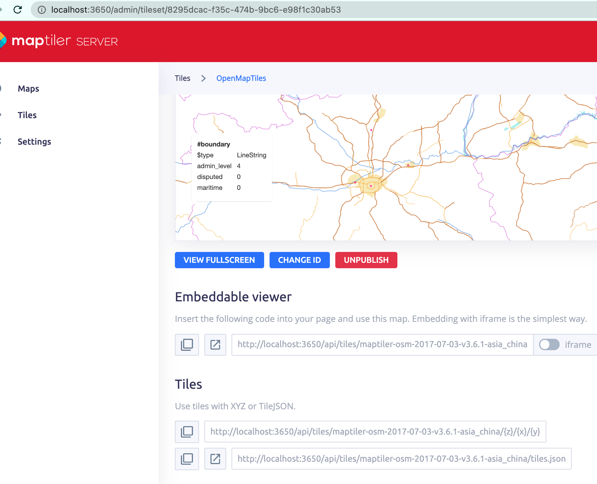
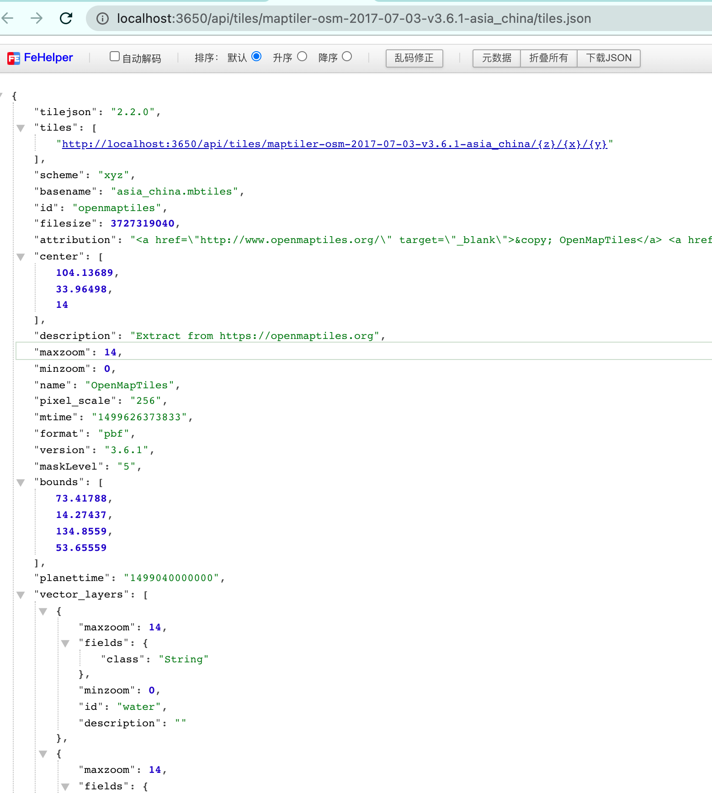

1. 通过Deck.gl 加载GeoJSON，前端拉伸为白模
    自定义程度高，效果较好，可自定义颜色效果，数据量大的时候会卡顿

2. 通过Deck.gl 加载 i3S
        性能较好，加载大面积相对流畅，但是存在缺陷，白模切片数据会在某一角度丢失不可见，自定义图层效果难度大

3. 通过Deck.gl 加载 3dtiles
4. 自己制作矢量地图，发布矢量瓦片服务并设置样式，对建筑物设置拉伸效果
    - 参考https://openmaptiles.org/docs/generate/custom-vector-from-shapefile-geojson/制作mbtiles矢量瓦片
    - https://openmaptiles.org/docs/ 安装 MapTiler Server 发布上一部生成好的矢量瓦片，会提供一个 tiles.json 的地址
    -  设置样式： https://openmaptiles.org/docs/style/maputnik/ 下载maputnik离线部署一套，填入上一步骤tiles.json地址，制作样式并生成style.json 
    - 地图加载
        
        