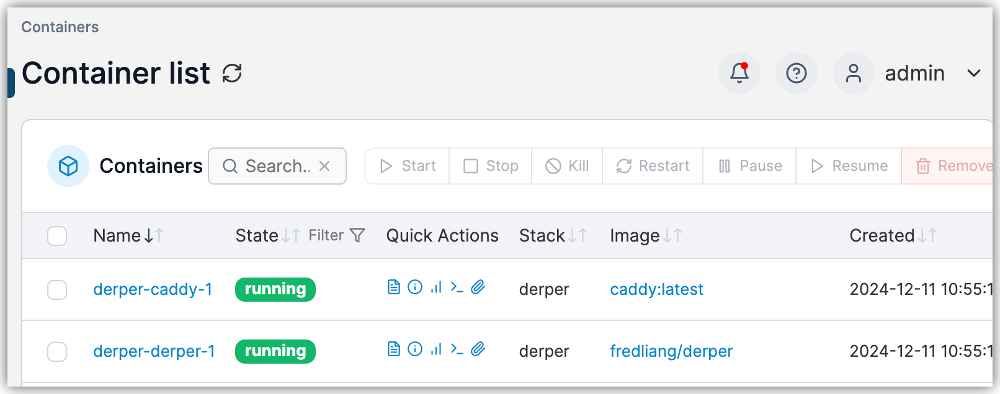
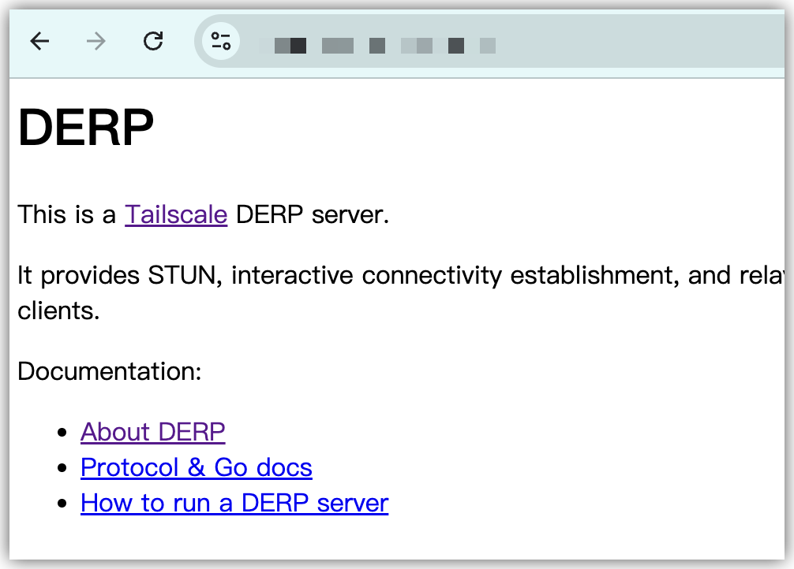
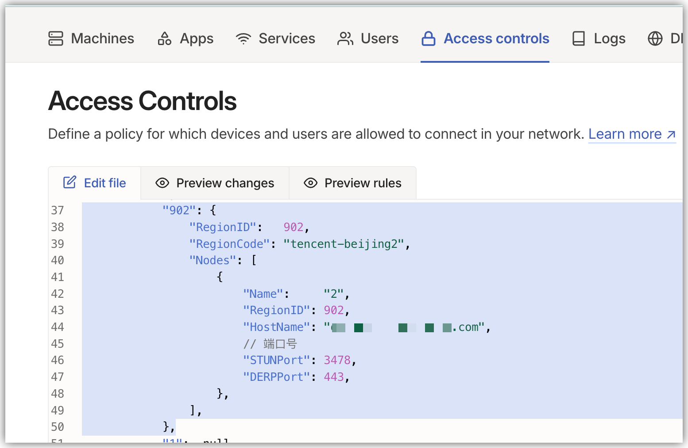
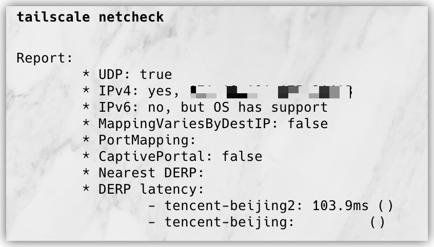

## 自建中继服务器
### 开始之前
3年前买的腾讯云轻量要过期了，续费太贵了，所以放弃不用，新买了一台99一年，安装ubuntu+docker镜像，开始搬迁一些服务。

另外分享一下，买云服务器的时候首先买了个阿里云的，结果在安装tailscale的时候，发现我这台阿里云北京的机器访问不了国际互联网，tailscale的网站是没有被墙的，试着ping了几个其他网站也都访问不通，故放弃，最后还是回到了腾讯云。

网上搜索了好久，花了一点时间，网上大家分享的都比较繁琐，所以整合了一下，基本上很轻松的部署了，证书什么的交给caddy自己处理。

### 前提
有域名，并且配置好dns将域名指向服务器ip，开放443，80、3478端口。安装好docker环境。

### 开始
```
mkdir -p /root/docker/caddy/config
mkdir -p /root/docker/caddy/data
cd /root/docker/
vi docker-compose.yml
```

`dokcer-compose.yml` 内容如下,把`your-domian.com`域名替换为自己的
```
version: '3'
services:
  derper:
    image: fredliang/derper
    restart: always
    ports:
      - 3478:3478/udp
    environment:
      DERP_DOMAIN: your-domian.com
      DERP_ADDR: ":23333"

  caddy:
    image: caddy:latest
    ports:
      - 80:80
      - 443:443
    volumes:
      - /root/docker/caddy/config/Caddyfile:/etc/caddy/Caddyfile
      - /root/docker/caddy/data:/data

```

`vi /root/docker/caddy/config/Caddyfile`

`Caddyfile`如下，把`your-domian.com`域名替换为自己的
```
https://your-domian.com {
    tls {
        get_certificate tailscale
    }
    reverse_proxy http://derper:23333
}
```

### 启动服务
```
docker compose up -d
```
确保服务正常运行，日志没有问题

浏览器打开配置的域名，检查是否成功


### 添加 Access Controls

```
			"902": {
				"RegionID":   902,
				"RegionCode": "tencent-beijing2",
				"Nodes": [
					{
						"Name":     "2",
						"RegionID": 902,
						"HostName": "example-domain.com",
						// 端口号
						"STUNPort": 3478,
						"DERPPort": 443,
					},
				],
			},
```


### 验证

```
tailscale netcheck
```



完成！

### 参考

https://www.xukecheng.tech/how-to-deploy-tailscale-custom-derper-servers-by-caddy
https://nex.xlog.app/Caddy-Docker-jian-dan-de-zi-jian-Tailscale-DERP