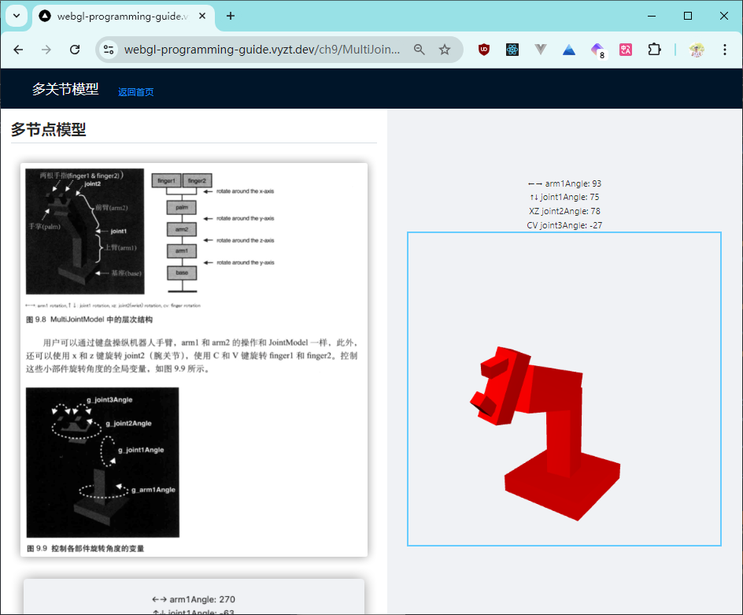

> 这是2022年学习WebGL编程指南的笔记，学习的同时，将中间的一些关键Demo做成了可交互的站点。 使用next.js编写


# WebGL 编程指南笔记


> [WebGL编程指南 - 豆瓣介绍](https://book.douban.com/subject/25909351/)

## github
[https://github.com/gooin/webgl-programming-guide](https://github.com/gooin/webgl-programming-guide)

## 在线浏览本笔记

> [https://webgl-programming-guide.vyzt.dev/](https://webgl-programming-guide.vyzt.dev/)


## 本地运行

```bash
npm run dev
# or
yarn dev
```

Open [http://localhost:3000](http://localhost:3000) with your browser to see the result.
