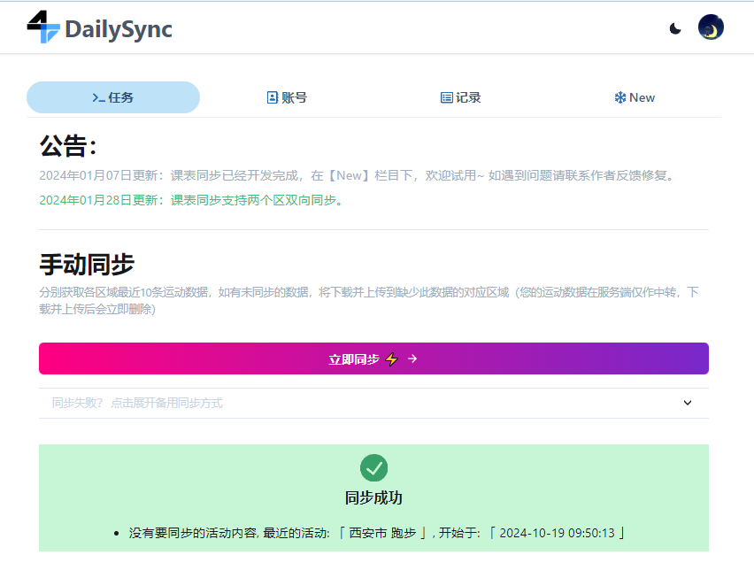
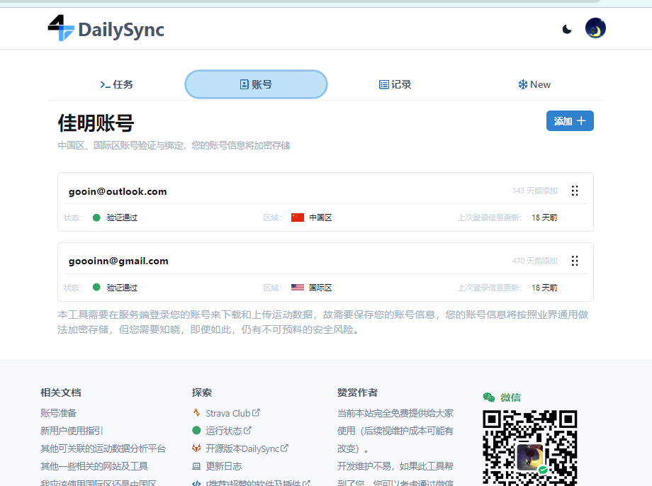
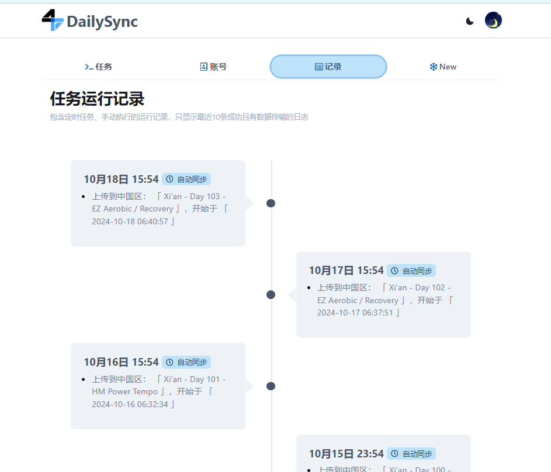
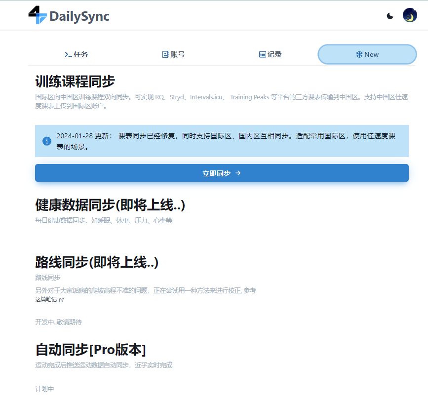
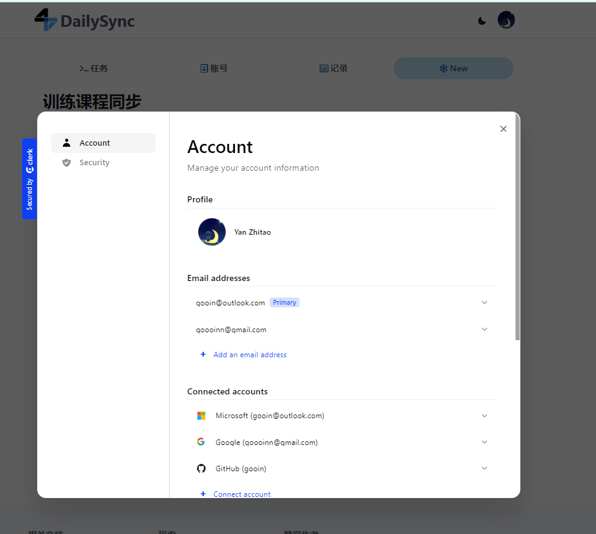
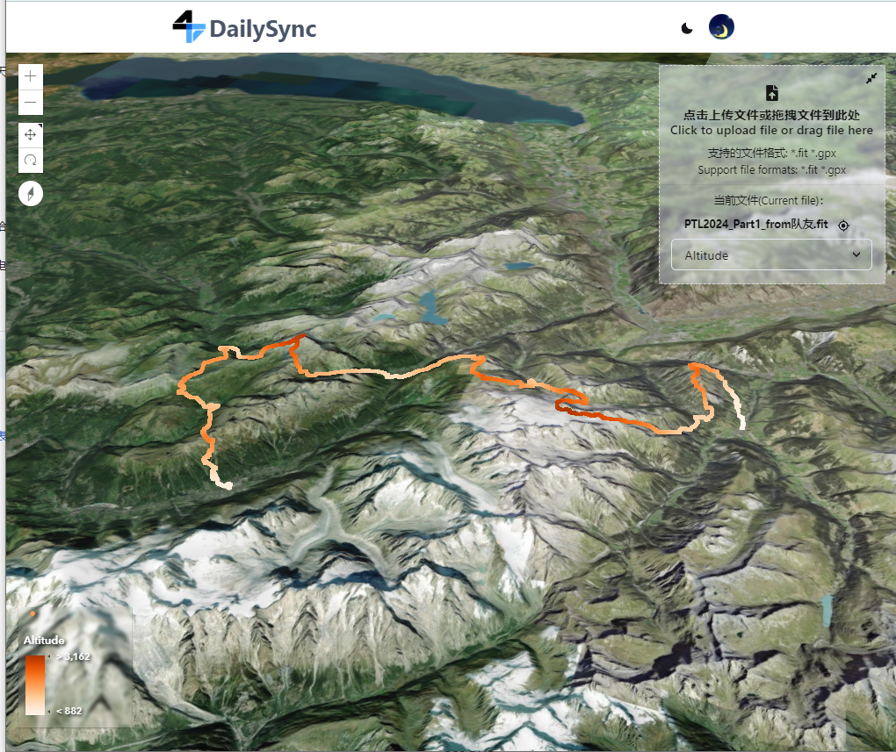
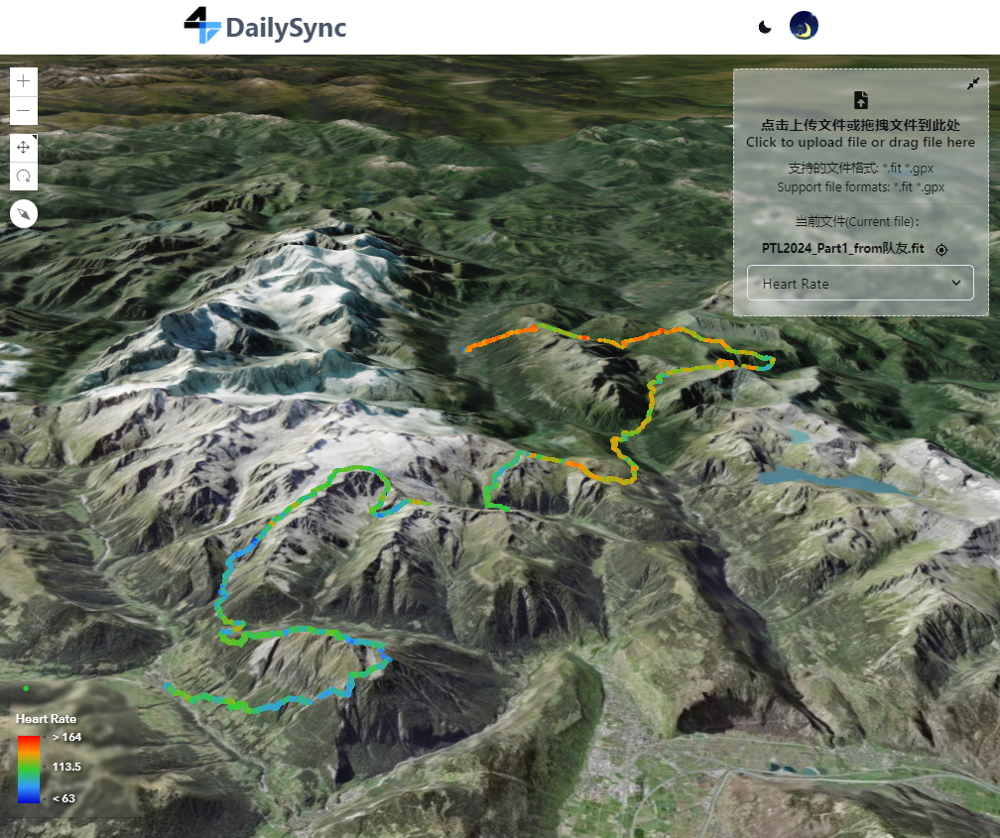
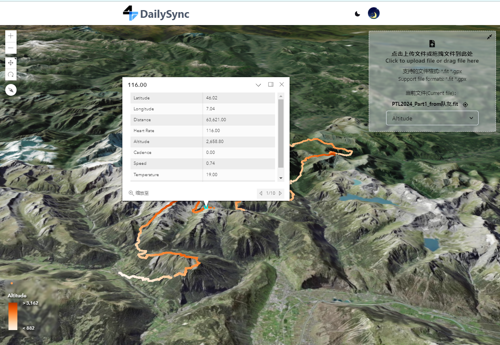

## DailySync

[https://dailysync.vyzt.dev/](https://dailysync.vyzt.dev/)

Garmin 佳明是一家专业的 GPS 设备制造商，其产品包括手表、智能手环、户外运动手表等。Garmin 佳明的账号体系分为中国区和国际区两个体系。

作为中国区佳明用户，想要使用国外的运动分析平台，比如 Strava、Runalyze、TrainingPeaks 等是无法直接使用的。

通过将两个佳明区域的运动数据同步，就可以解决国内外数据平台的互通。从 2022 年开始，DailySync 就是解决此问题而生。首先开发了开源版本，通过 nodejs 脚本来同步数据。并不是每个人都熟悉代码，进而开发了线上版本。前端 Next.js, 后端使用 Nest.js, 数据库使用 Postgres。

截止 2024-10 线上版本大约有 5000 名用户，平均每天服务提供 3000 条数据同步。

主要功能包含：

- 用户模块
- 佳明账号绑定模块
- 同步运动数据
- 定时任务执行
- 训练课程同步





### 线上版本

[https://dailysync.vyzt.dev/](https://dailysync.vyzt.dev/)

### 开源版本

#### github

[https://github.com/gooin/dailysync-rev](https://github.com/gooin/dailysync-rev)



#### gitlab

[https://gitlab.com/gooin/dailysync](https://gitlab.com/gooin/dailysync)



## DailySync fit file viewer

[https://dailysync.vyzt.dev/viewer](https://dailysync.vyzt.dev/viewer)

以 3D 地形视图查看运动轨迹数据信息

- 拖拽查看 fit 文件打点信息
- 查看每个点位心率海拔功率
- 地图渲染字段修改




